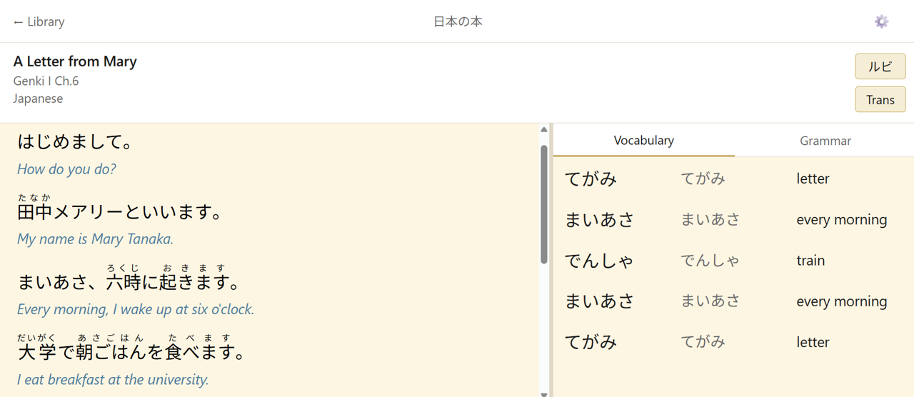
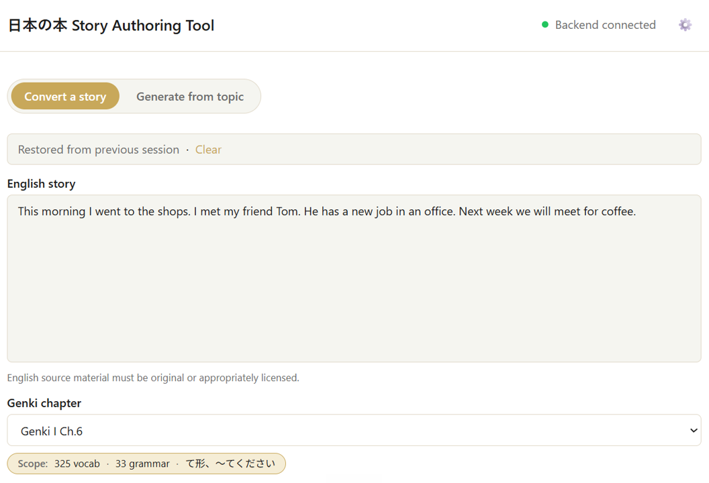

# 日本の本 — Nihon no Hon

A Japanese reading practice web app. Read graded stories word-by-word with instant vocabulary lookup, furigana annotations, kanji breakdown, and grammar notes.

_Author note: I've been learning Japanese for a couple of years now, and what I've found really helpful is reading texts at the right proficiency level that use the vocabulary and grammar I am studying. This is a reader app that is highly optimized for learning Japanese, and I'm building a story library with fine-grained difficulty levels, using generative AI._

---

## Features

- **Word-level vocabulary lookup** — tap any word token to see its meaning, reading, and lesson reference
- **Furigana (ruby) annotations** — toggle hiragana readings above each word on or off
- **Kanji breakdown** — selected words show each kanji character with its Heisig keyword
- **Grammar notes** — story-level grammar points, highlighted for the currently selected sentence
- **Sentence translations** — toggle inline English translations per sentence
- **Story library** — browse built-in stories with source and chapter difficulty filters (Genki I/II, JLPT)
- **Local story upload** — load your own `.json` story file directly from your device
- **Persistent preferences** — ruby, spacing, translation, and text size settings survive page refresh
- **Responsive layout** — two-column reader on desktop; tabbed Story / Vocabulary / Grammar on mobile
- **Accessibility** — ARIA labels and WCAG 2.1 AA coverage via axe-core

---

## Reader App

The reader app is a single-page web application deployed at [nihonnohon.vercel.app](https://nihonnohon.vercel.app). It is optimised for reading Japanese stories at a controlled difficulty level, with in-place linguistic support so you can stay in the flow of reading.



**Library view** — browse the built-in story collection filtered by source textbook (Genki I/II, JLPT) and chapter. Each card shows the title, difficulty badge, and a short synopsis. You can also load your own `.json` story file from disk.

**Reader view** — the story is split into sentence blocks and tokenised into individual words. Select any word to open an inline popover with its reading, English meaning, and the lesson where it was first introduced. The kanji breakdown panel lists each character with its Heisig keyword, and the grammar panel highlights the current sentence's relevant grammar points.

Persistent preferences (furigana on/off, sentence translations, text size, word spacing) are saved across sessions. On desktop the vocabulary and grammar panels sit in a sidebar; on mobile they collapse into tabs.

---

## AI Story Authoring Tool

The story authoring tool allows you to convert or generate stories with fine-grained control of the language difficulty. It is a separate app (currently local-only, frontend on port 5174, Python backend on port 8000) that uses Google Gemini to generate stories in the required JSON format. Run it from `apps/story-generator-backend/` with `make dev`.



Stories can be generated two ways:

- **Path A — adapt existing text.** Paste a Japanese source text (e.g. a textbook passage) and the tool annotates it with vocabulary, furigana, grammar notes, and sentence translations to produce a ready-to-read story file.
- **Path B — generate from a topic.** Describe a topic or scenario in English. The tool first proposes an English story draft for you to review and edit, then converts the approved draft into annotated Japanese at your chosen difficulty level.

Both paths let you set the target chapter (e.g. _Genki I Ch. 6_), steer the output with free-text instructions, adjust the grammar complexity distribution, and — for Path B — pick a word-count preset (short ≈ 300 w, medium ≈ 600 w, long ≈ 1000 w). Generation is streamed token-by-token via AG-UI so you can watch the story being written in real time and cancel mid-run.

The output JSON is validated against the shared `story.v1.json` schema before download. Attribution fields (author, source, license) are injected automatically.

---

## Tech Stack

| Layer | Technology |
|-------|-----------|
| Frontend | React 18, TypeScript 5 (strict), Vite 5 |
| Routing | react-router-dom v6 (`createBrowserRouter`) |
| State | Zustand 4 (`lookupStore`, `preferenceStore`) |
| Styling | Tailwind CSS 3, Radix UI Popover, custom design tokens |
| Schema | JSON Schema Draft-07 (`story.v1.json`) |
| Validation | AJV 8 (TypeScript), `jsonschema` (Python story generator) |
| Monorepo | pnpm 11 workspaces + Turborepo 2 |
| Testing | Vitest 3 (unit), Playwright 1.44 (E2E, 3 browsers) |
| Deployment | Vercel (static SPA, `apps/web` root) |

### Internal packages

| Package | Purpose |
|---------|---------|
| `@nihonnohon/schema` | Shared TypeScript types + JSON Schema story contract |
| `@nihonnohon/story-loader` | Versioned story loader: validate → transform wire→model |
| `@nihonnohon/eslint-config` | Shared ESLint rules |
| `@nihonnohon/typescript-config` | Shared tsconfig bases |

---

## Getting Started

### Reader app

```bash
pnpm install
turbo dev
```

The reader app runs at `http://localhost:5173`.

### AI Story Authoring Tool

The authoring tool requires a separate Python backend. From `apps/story-generator-backend/`:

```bash
python -m venv .venv
source .venv/bin/activate   # Windows: .venv\Scripts\activate
pip install -r requirements.txt
cp .env.example .env
# Edit .env and add your GEMINI_API_KEY
make dev
```

The frontend runs at `http://localhost:5174` and the backend API at `http://localhost:8000`.

See [CONTRIBUTING.md](./CONTRIBUTING.md) for the full setup, testing, and contribution guide.

---

## Documentation

Comprehensive project documentation is in [`docs/`](./docs/):

- [`docs/index.md`](./docs/index.md) — master documentation index
- [`docs/architecture-web.md`](./docs/architecture-web.md) — web app architecture
- [`docs/data-models.md`](./docs/data-models.md) — story format and TypeScript types
- [`docs/development-guide.md`](./docs/development-guide.md) — dev setup and workflow

---

## Development

This project was designed and implemented using the **[BMAD Method](https://github.com/bmad-method)** with **[Claude Code](https://claude.ai/code)** — an AI-assisted development workflow covering product discovery, architecture, sprint planning, and iterative story implementation.

---

## License

This project is released under the [MIT License](./LICENSE). Copyright (c) 2026 Rupert Thomas.
