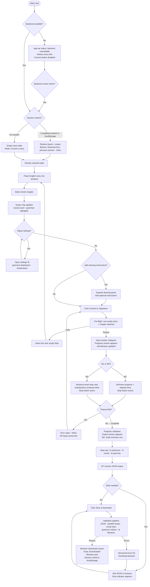
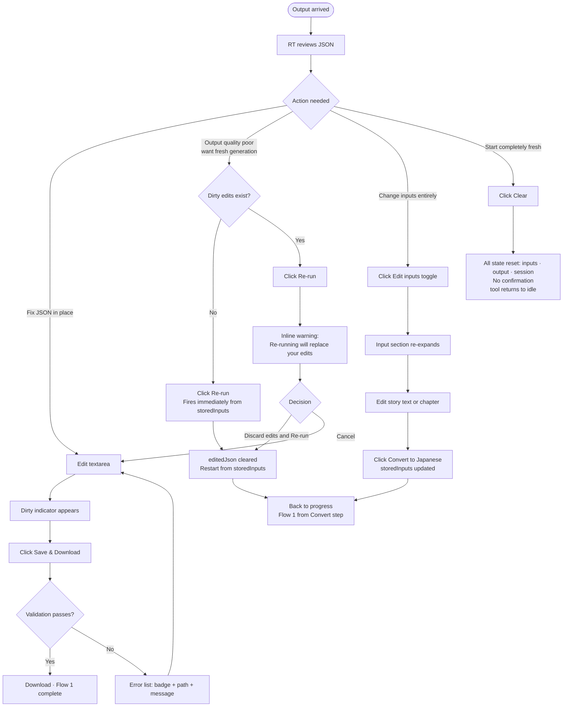
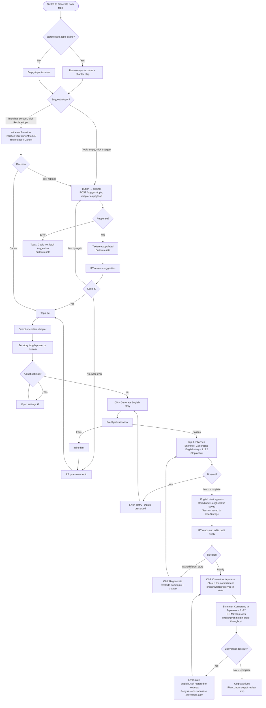

# UX Design Specification nihonnohon Story Authoring Tool

**Author:** RT
**Date:** 2026-05-15

---

<!-- UX design content will be appended sequentially through collaborative workflow steps -->

## Executive Summary

### Project Vision

The nihonnohon Story Authoring Tool is a local developer tool that eliminates
the hours-per-story content bottleneck blocking the nihonnohon v1 library launch.
RT pastes an English story, selects a target Genki chapter difficulty, clicks
Generate — the output is a schema-valid, curriculum-calibrated Japanese story
JSON file ready to load directly into the nihonnohon app. The architecture
anticipates a future public deployment (v2) — React/Vite frontend, Python ADK
backend — but v1 is desktop-only, localhost, single-user.

Three milestones: M1 (prompt-grounded generation, browser UI), M2 (4-agent
ReAct workflow — reasoning, action, grammar checker, final QC — with a single
agent status message line added to the progress display), M3 (Path B: topic →
English proposal → Japanese story). The UX contract is identical across
milestones — M2 and M3 require no redesign.

### Target Users

**Primary — RT (v1)**
Solo developer and nihonnohon content author. Uses the tool at localhost on
desktop. Technically comfortable: reads and edits raw JSON, understands the
story schema, runs the Python backend manually. Time-sensitive: one valid
generated story is the gate to nihonnohon v1 launching publicly. Efficiency
and correctness matter more than polish.

**Future — Community Authors (v2)**
Japanese language teachers and advanced learners contributing to the nihonnohon
shared story library. Will use a deployed public web interface. Needs story
preview (rendered as the nihonnohon reader), authentication, responsive layout.
Design choices in v1 should not close off this path.

### Key Design Challenges

**1. Progress feedback for a slow, opaque pipeline**
Generation takes up to 60 seconds. The AG-UI event stream provides real signals
from the LLM and (in M2) periodic agent status messages. The UI must translate
this into meaningful progress feedback — not a static spinner, not a fake
percentage bar. In M2, the backend emits `AGENT_STATUS` events with plain-English
messages ("Planning story structure…", "Checking grammar…", "Running quality
review…") that the UI displays as a single updating text line below the shimmer
bar. Critically: in M1 the stream gives only a start and end signal
(structured Pydantic output arrives whole); meaningful status feedback only
becomes possible in M2.

**2. JSON textarea as dual review and edit surface**
The output area is simultaneously a read surface (review what was generated)
and an edit surface (correct mistakes). Raw JSON editing in a textarea is
error-prone. The validation loop must be tight: click Save, get clear
sentence-level feedback, fix, click Save again. The validator must be a pure
function with structured error output — one row per error, rule badge +
JSON path + human-readable message — not a flattened string.

**3. Re-run vs. manual edit conflict**
The tool must warn before Re-run overwrites manual edits. This is a small
but high-stakes moment — the warning must be unmissable without disrupting
clean-state Re-runs. The real risk is silent loss of good edits, not just
data loss: a diff of what would be discarded is more useful than a generic
confirmation dialog. The re-run action must always read from stored original
inputs, never from the textarea.

## Core User Experience

### Defining Experience

The core loop: paste an English story → select a Genki chapter → Generate →
review output → Save → download JSON. That complete pipeline, executed in under
5 minutes with a schema-valid result, is the entire product value. Everything
else serves or surrounds it.

The tool is a content pipeline, not a reading experience. The primary output is
a file on disk. The UX job is to make the pipeline feel fast, transparent, and
correctable — not to delight, but to not obstruct.

### Platform Strategy

- **Platform:** Desktop web only (v1). Accessed at localhost via browser.
- **Primary input:** Mouse and keyboard. No touch-optimisation required.
- **Offline behaviour:** Not supported. The tool requires a live Python backend
  and active Gemini API connection. No PWA, no service worker.
- **Screen size:** Single layout, no responsive breakpoints in v1. Designed for
  a desktop viewport (1280px+). v2 responsive design deferred to v2 PRD.

### Effortless Interactions

- **Story paste:** Standard textarea — CMD/CTRL+V lands the English prose
  instantly. No special handling, no formatting strip needed.
- **Chapter selection:** Single dropdown interaction. Scope summary chip appears
  immediately — no additional action required to understand the calibration scope.
- **Generation trigger:** Single button click. Cancel available throughout.
  Session auto-saves on completion — no explicit save-draft step.
- **Validation on Save:** One click, immediate structured feedback. Errors are
  line-indexed and actionable — RT navigates directly to the problem.
- **Download:** One click after validation passes. Browser native download to
  Downloads folder. No "where do you want to save this?" friction.

### Critical Success Moments

1. **First successful generation (M0/M1 launch gate):** RT's English story
   becomes a renderable Japanese story JSON in under 5 minutes. This single
   event unblocks the nihonnohon v1 public launch. The moment the generated
   JSON loads correctly in the nihonnohon reader is the product's proof of life.

2. **First clean download:** Validation passes on first attempt after generation.
   RT clicks Download. The file lands. No manual correction required — the
   generation was good enough to ship directly. This is the target experience
   for most runs.

3. **Catching and correcting a structural error:** A parallel array violation
   surfaces as "sentences[3]: words has 5 tokens, ruby has 4." RT locates
   line 47 in the textarea, adds the missing ruby entry, clicks Save again.
   Validation passes. Download proceeds. The tight fix loop worked.

4. **Watching M2 earn its output:** In M2, the progress area shows a single
   status line that updates as the 4-agent pipeline advances — "Planning story
   structure…", "Checking grammar…", "Running quality review…". When the JSON
   arrives, RT knows the tool did quality work without needing a sentence-level
   audit. Trust is built through transparency about what the pipeline is doing,
   not through exhaustive per-sentence reporting.

### Experience Principles

1. **Pipeline transparency over reassurance.** Don't manage RT's anxiety with
   animations or fake progress bars. Show what's actually happening — or, when
   nothing meaningful is happening (M1 structured output), show an honest
   indeterminate state. Authentic signals build more trust than polished theater.

2. **Structural validity and curricular validity are different jobs.** The
   client-side validation suite catches schema errors. It does not catch
   curriculum compliance errors. In M1, RT is the curriculum gate — he needs
   enough visibility into the generated content to make that judgment. In M2,
   the agent provides that visibility. The UX must not conflate the two.

3. **Correctability over perfection.** The tool will sometimes generate output
   that needs manual correction. That is expected and fine. The UX goal is to
   make the correction cycle as fast and frictionless as possible — not to
   imply the output should be accepted as-is.

4. **No decisions that close off v2.** API base URL parameterised. Session state
   is a convenience cache, not a primary store. Progress component is event-driven
   and label-driven. These v1 decisions cost nothing now and make the Cloud Run
   + Vercel transition a configuration change rather than a refactor.

### Design Opportunities

**1. Genki chapter selector as a curriculum-aware UI moment**
The chapter selector is what makes this tool unique — not a generic difficulty
label but a specific curriculum position. A scope summary chip below the
selector ("~180 vocab items · 24 grammar patterns · て-form, particles は/が/を")
makes the calibration promise legible and reinforces the tool's key
differentiator. The chip content can be hardcoded in M1 (Genki chapters are
stable) and derived from grounding data in M2+.

**2. AG-UI streaming as a trust surface**
The `AGENT_STATUS` events from M2's 4-agent pipeline turn waiting time into
evidence of quality. A single updating status line ("Planning story structure…",
"Checking grammar…", "Running quality review…") reassures RT that the pipeline
is actively working and not stalled — without requiring a sentence-level audit
interface. The trust comes from knowing the agents ran, not from watching every
step.

**3. Tight, sentence-indexed validation feedback**
Validation errors tied to specific sentence numbers and JSON paths, with
human-readable descriptions, make the review-correct cycle fast. Running
validation rules in dependency order (parse first, then structural, then
semantic) and surfacing errors as a scannable list rather than a paragraph
ensures RT can locate and fix problems without a full code editor.

## Desired Emotional Response

### Primary Emotional Goals

The primary emotional goal is **productive confidence** — after a successful
run, RT should feel: *I created that story.* The tool did the hard mechanical
work; RT made the curriculum and content decisions. That distinction matters.
He is the author. The tool is the pipeline.

Supporting goals: trust in the output calibration, efficiency satisfaction
("that took four minutes"), and relief — specifically the relief of being
unblocked. One valid story is all that stands between the current state and
nihonnohon v1 shipping publicly. That release of pressure on first success is
the emotional anchor of the entire product.

### Emotional Journey Mapping

| Stage | Desired feeling | Emotion to avoid |
|---|---|---|
| Opening the tool | Ready, oriented — "I know what to do" | Confusion about what's needed |
| During generation | Calm confidence — "it's working" | Anxiety about silent failure |
| Watching M2 progress | Impressed, validated — "it's actually checking" | Skepticism about quality |
| Output arrives | Anticipation, critical — "let me see what it made" | Over-trust or under-trust |
| Validation passes first try | Efficient satisfaction — "clean run" | Nothing — this should feel unremarkable |
| Validation fails | In-control — "I can see exactly what to fix" | Frustration, helplessness |
| After manual correction + save | Competent — "I caught that and fixed it" | Deflated by the effort |
| Download completes | Done — "next story" | Ceremonial, over-celebrated |
| First story loads in nihonnohon | Relief, quiet triumph — "we can ship" | Anticlimax |

### Micro-Emotions

**Trust calibration, not blind acceptance.** RT is the quality gate in M1.
The tool must not imply the output should be accepted without review. Progress
feedback, scope summary, and structured validation all serve the same purpose:
giving RT the information he needs to make an informed judgment, so his trust
in the output is earned rather than assumed.

**The 60-second wait is not wasted time.** The progress surface reframes
waiting as monitoring. RT is watching the pipeline run, not staring at a
spinner. This is the difference between feeling in control and feeling held
hostage by a slow process.

**Validation failure is not a product failure.** Getting a validation error
should feel like catching a problem early — the system working as designed —
not like the tool letting RT down. Structured, actionable error output is what
makes the difference between "the tool helped me fix it" and "the tool told me
something was wrong without helping."

**Re-run after editing is a high-stakes micro-moment.** If RT accidentally
loses manual corrections by hitting Re-run, the emotional impact is
disproportionate — it doesn't just waste effort, it erodes trust in the tool.
The dirty-state warning exists entirely to prevent this one emotional outcome.

### Design Implications

| Emotional goal | UX design approach |
|---|---|
| Productive confidence | Scope summary chip shows RT what he's committing to; validation confirms correctness — RT owns the decisions |
| Earned trust (M1) | Scope chip makes calibration visible; structural validation is comprehensive and fast |
| Earned trust (M2) | Single agent status line shows the 4-agent pipeline advancing — RT knows quality work was done |
| Calm during wait | Honest indeterminate progress (M1); genuine step-level events (M2); elapsed time visible |
| In-control on error | Structured validation: one row per error, rule badge + JSON path + human sentence |
| Correct without ceremony | Download confirmation is a brief toast, not a celebration screen |
| Rerun safety | Dirty-state indicator + inline warning with consequence-labelled confirm button |

### Emotional Design Principles

1. **Competence is the reward.** The tool does not congratulate RT or make
   the experience feel momentous. A clean run should feel efficient and
   unremarkable. The emotional payoff comes from the output working in the
   nihonnohon reader, not from the tool celebrating itself.

2. **Transparency builds more trust than reassurance.** A fake progress bar
   that reaches 90% and stalls is more anxiety-inducing than an honest
   indeterminate spinner. Show what the system actually knows; don't paper
   over uncertainty with animation.

3. **Errors are information, not failures.** Validation errors are the system
   working correctly — they prevented a bad file from being saved. Frame them
   that way: precise, located, fixable. Never present them as a wall.

4. **RT is the author.** Every design decision that gives RT visibility and
   control — scope summary, structured errors, dirty-state warning, audit trail
   — reinforces that he is making the decisions. The AI is doing the mechanical
   work. The judgment calls are his.

## UX Pattern Analysis & Inspiration

### Inspiring Products Analysis

**GitHub Actions / CI log viewer**
The benchmark for showing pipeline progress to a developer. Step-level status
rows (✓ / ⟳ / ✗), timestamped auto-scrolling logs, persistent run summary
after completion, honest elapsed time rather than ETAs. The developer reads
the log to understand what happened, not just whether it succeeded. Direct
model for M2 agent step display.

**Postman**
The benchmark for "configure a job, fire it, inspect the result." Input/config
panel feeds a response panel. Send transitions to Cancel during a request.
Response body is monospace with metadata alongside. Mental model — configure,
fire, inspect — maps exactly to Generate → Output. Key adaptation: after
generation completes, the input panel should collapse rather than stay equally
prominent — RT authored it and no longer needs it front-and-centre — but it
must remain accessible for re-editing without a destructive action.

**OpenAI Playground / Replicate**
The established pattern for exposing LLM generation parameters alongside a
generation form. Temperature as a slider with a numeric readout. Output length
as labelled presets (short / medium / long) with a custom numeric fallback.
Key insight: these controls live in a settings panel, not inline with the
primary form — they're power-user parameters that don't interrupt the main
authoring flow but must be discoverable. The settings panel opens as a
popover or slide-out sheet; context is not lost.

**v0.dev / GitHub Copilot**
Streaming AI generation with cancel affordance normalises the review-and-correct
workflow. Treating AI output as an editable starting point, not a final
artifact, is now an established pattern for this interaction class.

**VS Code JSON editing (pattern)**
Monospace font, line numbers, and line-level error indicators are the grammar
for "you are editing structured text." For a predominantly read-only output
surface, a `<pre>` with CSS `counter-increment` line numbering is lower
implementation cost than a textarea overlay — and avoids scroll-sync drift
bugs. If inline editing is required, CodeMirror is the correct choice; a
line-numbered textarea is not a real pattern.

### Transferable UX Patterns

| Pattern | Source | Application |
|---|---|---|
| Single updating status text line | GitHub Actions (adapted) | M2 agent pipeline messages — plain-English updates below the shimmer bar |
| Elapsed time during run | GitHub Actions / Postman | Replaces fake ETAs during generation |
| Generate → Stop button transition | Postman | Active during generation — requires real backend cancellation |
| Input collapse post-generation | Postman (adapted) | Input section collapses after Generate; "Edit inputs" toggle re-expands |
| Settings gear / slide-out panel | VS Code / GitHub | LLM temperature + story length live behind a settings control |
| Length presets + custom numeric | OpenAI Playground / Replicate | Short (~100w) / Medium (~250w) / Long (~500w) / Custom (≤1000w) |
| Temperature slider + numeric readout | OpenAI Playground | Slider for intuition; numeric input for precision |
| Monospace + line numbers for structured text | VS Code | JSON output surface — `<pre>` + CSS counters preferred over textarea hack |
| Structured error list with location | VS Code / linters | Validation errors: rule badge + path + message per row |
| Output as editable starting point | v0.dev / Copilot | Generated JSON is a draft; correction is expected |

### Anti-Patterns to Avoid

- **Chat/conversational interface** — RT is submitting a batch job, not having
  a dialogue. Chat implies iterative back-and-forth; the actual flow is
  configure → fire → review → save.
- **Wizard / multi-step flow** — all inputs fit on one screen. Wizard steps
  add clicks for a power user with no benefit.
- **Fake progress percentage** — LLM generation has no reliable ETA. A bar
  stuck at 90% is more anxiety-inducing than an honest indeterminate state.
- **Modal validation errors** — errors belong inline, persistent until resolved.
  Modals require dismissal; toasts disappear. Neither survives the user
  navigating back to fix the problem.
- **Hiding the input permanently after generation** — RT may want to tweak
  inputs and regenerate. Collapsing the input is fine; destroying or fully
  obscuring it is not.
- **Inline LLM parameters** — temperature and length in the primary form
  increase visual noise for a user who won't change them every run. Settings
  panel keeps the primary flow clean.
- **Fake Stop button** — a Stop button that doesn't actually cancel the backend
  job erodes trust faster than not having one. Either implement real
  cancellation or replace with a "started — please wait" state indicator.
- **Auto-save to localStorage mid-generation** — creates the in-flight restore
  edge case. Persist completed sessions only.

### Design Inspiration Strategy

**Adopt directly:** GitHub Actions step rows for M2 progress; elapsed time
display; `<pre>` + CSS counters for monospace line-numbered output; labelled
presets + custom numeric for story length; temperature slider + numeric readout;
settings panel as slide-out or popover (shadcn Sheet or Popover).

**Adopt and adapt:** Postman's generate/inspect mental model → input collapses
post-generation but remains accessible via an "Edit inputs" toggle; OpenAI
Playground's parameter placement → settings behind a gear icon rather than
inline.

**Design forward (no prior art):** Genki chapter scope summary chip showing
cumulative vocab/grammar count; M2 curriculum substitution surfacing in the
output. Three-state UI choreography (pre-generation / generating / complete)
to be designed in a later step.

### New Requirements Captured

- **Story length setting:** Short (~100w) / Medium (~250w) / Long (~500w) /
  Custom (numeric entry, max 1000w). Passed to backend as generation metadata.
- **LLM temperature setting:** Slider + numeric readout. Passed to backend as
  generation metadata.
- Both settings live in a settings panel (gear icon), not inline in the
  primary form.
- Input section collapses after generation but remains re-expandable — RT
  must be able to edit inputs and regenerate without clearing the form.

## Design System Foundation

### Design System Choice

**Tailwind CSS + shadcn/ui** — inherited directly from `apps/web` in the
nihonnohon monorepo.

The story authoring tool shares `@nihonnohon/typescript-config`,
`@nihonnohon/eslint-config`, and the same React/Vite/Tailwind/shadcn stack.
The design system choice is not a decision to make — it is a constraint to
embrace. Shared tokens, shared primitives, shared conventions.

### Rationale for Selection

- **Monorepo consistency:** `apps/story-generator/` is a sibling of `apps/web`.
  Shared ESLint, TypeScript config, and Tailwind token definitions are already
  in place. Diverging onto a different stack would create a maintenance split
  with no benefit for a solo developer.
- **Shared design tokens:** The nihonnohon colour palette (`paper-bg`,
  `surface`, `accent`, `muted`, `border`, `error`) applies directly to the
  authoring tool — the warm paper tone is a brand anchor across both products.
- **shadcn/ui component availability:** The specific components needed for
  this tool (Sheet, Collapsible, Slider, Badge, Select, Toast) are all
  available as shadcn/ui primitives, styled to spec with Tailwind.
- **Solo developer fit:** No new tooling to learn, no new dependency to
  maintain. All the patterns from `apps/web` apply here.

**Visual register caveat:** The nihonnohon reader is warm, book-like, reading-
focused. The authoring tool is a developer utility — it shares the palette but
applies it in a more functional register. The `surface` and `surface-subtle`
tones anchor the tool UI; `paper-bg` is reserved for preview contexts (v2
story preview mode) where the reader aesthetic is directly relevant. The tool
should feel like it belongs in the same family as the reader, not like a
copy of it.

### Implementation Approach

- Tailwind CSS for all styling, using the existing token definitions from
  `apps/web/tailwind.config.js` (or a shared config if extracted). No new
  colour tokens needed for v1.
- shadcn/ui primitives for: `Sheet` (settings panel), `Collapsible` (input
  section post-generation, audit summary), `Slider` (temperature), `Badge`
  (validation error rule labels, scope chip), `Select` (Genki chapter),
  `Toast` (download confirmation), `Button` (Generate/Stop transition).
- `cn()` utility from `@/lib/utils` for all class composition — no raw
  string concatenation.
- Monospace font for JSON output surface: `font-mono` Tailwind class
  (system monospace stack). Not `font-ja` — the output display is JSON,
  not Japanese prose.

### Customization Strategy

**Tokens in use (no new tokens required for v1):**

| Token | Usage in authoring tool |
|---|---|
| `surface` | Primary UI background — tool chrome, panels, cards |
| `surface-subtle` | Input textarea background, settings panel interior |
| `accent` / `accent-subtle` | Active states, scope chip border/background |
| `muted` | Secondary labels, elapsed time, sentence position in progress rows |
| `border` | Panel dividers, input borders |
| `error` | Validation error rule badges, error message text |
| `paper-bg` | Reserved for v2 story preview mode only |

**Custom components required (no shadcn/ui equivalent):**

| Component | Purpose |
|---|---|
| `GenerationProgress` | M1 indeterminate pulse + elapsed time; M2 sentence-level step rows — single component, discriminated union state |
| `JsonOutput` | Monospace line-numbered output display (`<pre>` + CSS counters); read-only with copy affordance |
| `ScopeChip` | Genki chapter cumulative scope summary — vocab count + grammar highlights |
| `ValidationErrorList` | Structured error rows: rule badge + JSON path + message |
| `InputSection` | Collapsible wrapper around English story textarea + chapter selector; expands via "Edit inputs" toggle post-generation |
| `SettingsPanel` | shadcn Sheet or Popover wrapping temperature slider + story length controls |

## Defining Experience

### 2.1 Defining Experience

> *Paste an English story. Select a Genki chapter. Get a Japanese story you can ship.*

The tool's entire value collapses to a single pipeline: English prose in,
schema-valid curriculum-calibrated Japanese JSON out. If that pipeline
completes in under 5 minutes with an output RT can review and trust, the
product succeeded. Everything else — settings, session restore, re-run
recovery, M2 substitution surfacing — serves or protects this core pipeline.

### 2.2 User Mental Model

RT is not a typical end user. He designed the story schema, built the
nihonnohon reader, and understands the Genki curriculum deeply. The mental
model he brings is that of a **developer using a batch processing API** —
not a consumer using an AI assistant.

He expects:
- A form to configure the job (English story + target chapter)
- A trigger to submit it (Generate)
- A wait period where the job runs (progress feedback)
- A result to inspect and accept or correct (JSON output)
- A save action that validates and exports (Download)

This mental model is already well-established through tools like Postman,
GitHub Actions, and AI generation playgrounds. No user education is needed
for the core flow. The novel elements — scope summary chip, M2 substitution
surfacing — require no instruction because they are passive information
surfaces, not interactive patterns.

**What RT does NOT expect:**
- A conversational or chat interface
- Wizard-style step-by-step guidance
- Automatic acceptance of output without review
- The tool making curriculum decisions without surfacing them

### 2.3 Success Criteria

- **Under 5 minutes end-to-end:** From opening the tool to a downloaded
  `.json` file, including one correction cycle if needed.
- **Schema validation passes automatically:** RT never sees a validation
  error caused by the generation itself — only by his own manual edits.
- **RT can answer "would a Ch.N student understand this?" from the output:**
  Either from his editorial read in M1, or from the M2 audit trail — the
  tool gives him enough information to make that judgment.
- **Re-run or correction does not lose inputs:** All inputs survive any
  error state, timeout, or Re-run action.
- **Download is the final action:** No post-download steps required in the
  tool. RT adds the file to `manifest.json` separately.

### 2.4 Novel UX Patterns

The core pipeline (configure → generate → review → save) uses entirely
established patterns. Two novel surfaces are introduced:

**Genki chapter scope summary chip** — no existing tool surfaces curriculum
scope in this way. The chip makes a normally invisible constraint (cumulative
Ch.1–N vocabulary and grammar) legible at the point of configuration. It
requires no user education because it is informational, not interactive. RT
reads it, gains confidence in what the tool will do, and proceeds.

**M2 agent status messaging** — a single updating text line showing the current
agent phase ("Planning story structure…", "Checking grammar…", "Running quality
review…") makes the 4-agent pipeline transparent without overwhelming the UI.
This is a deliberately minimal trust signal: RT knows the agents ran and what
they were doing, without needing a sentence-level audit trail. It adapts the
CI log pattern to a consumer tool context — progress by named phase rather
than by individual step.

### 2.5 Experience Mechanics

| Stage | What happens |
|---|---|
| **Initiation** | RT opens the tool. Input section is visible: English story textarea, Genki chapter selector, optional steering panel (collapsed by default), settings gear. Session is restored from localStorage if available. |
| **Configuration** | RT pastes English prose. Selects a Genki chapter. Scope chip updates immediately to show cumulative vocab/grammar count. Settings adjusted if needed (story length, temperature). |
| **Trigger** | RT clicks Generate. Pre-flight validation runs (non-empty story, chapter selected, word count within configured limit). If valid: Generate transitions to Stop; progress surface appears. |
| **Generation (M1)** | Indeterminate progress bar with elapsed time. "Generating story…" label. Stop button available. 60-second timeout triggers error state with Retry; all inputs preserved. |
| **Generation (M2)** | Same shimmer as M1 plus a single status text line below it that updates with each `AGENT_STATUS` event: "Planning story structure…", "Generating story…", "Checking grammar…", "Running quality review…". Stop button available throughout. |
| **Output arrival** | Progress surface collapses. JSON output becomes visible in the output section. Input section re-expands collapsed (accessible via "Edit inputs" toggle). Stop transitions back to Generate (and Re-run). |
| **Review** | RT reads the JSON output. Optionally edits inline. Dirty indicator appears on first edit. Scope chip remains visible as reference. |
| **Save** | RT clicks Save. Validation pipeline runs: JSON parse → schema version + required fields → parallel arrays → vocab keys + grammar indices + id filename. Errors surfaced as structured list; download blocked until all pass. |
| **Download** | Validation passes. Browser downloads `{id}.json` (UTF-8, no BOM). Toast confirms download. Session state saved to localStorage. |
| **Re-run** | If RT wants to regenerate: if no edits, Re-run fires immediately from stored original inputs. If edits exist, inline warning appears with "Discard my edits and Re-run" confirm. |

## Visual Design Foundation

### Colour System

The authoring tool inherits the nihonnohon colour token system with no new
tokens required for v1. Application differs from `apps/web` in register:
the tool uses `surface` as its primary background rather than `paper-bg` —
the warm paper tone is preserved for v2 story preview mode, where the reader
aesthetic is directly relevant. The tool should feel related to the reader
but not identical.

| Token | Value | Usage in authoring tool |
|---|---|---|
| `surface` | `#FFFFFF` | Primary UI background — page, panels, cards |
| `surface-subtle` | `#F5F5F0` | Input textarea background, settings panel interior, progress row background |
| `paper-text` | `#1C1C1C` | All primary text — labels, JSON output, error messages |
| `accent` | `#C8A85A` | Active states, Generate button primary, scope chip border |
| `accent-subtle` | `#F5EDD6` | Scope chip background, hover states, M2 substitution highlight in output |
| `muted` | `#6B6B6B` | Elapsed time, secondary labels, step row sentence numbers, "Edit inputs" toggle |
| `border` | `#E0D8C8` | Panel dividers, input borders, section separators |
| `error` | `#C0392B` | Validation error rule badges, error message text, pre-flight validation failures |
| `paper-bg` | `#FDF6E3` | Reserved — v2 story preview mode only |

**Status colours for progress rows (M2):**
- Complete (✓): `accent` — warm amber check
- In progress (⟳): `muted` — neutral, not alarming
- Pending (—): `border` — receded, not yet active
- Substitution flag: `accent-subtle` background + `accent` left border — warm, informational, not alarming

No new tokens are introduced in v1. All status states are achieved through
combinations of existing tokens.

### Typography System

Three distinct typographic roles, each serving a different surface:

| Role | Font | Class | Usage |
|---|---|---|---|
| UI text | Inter (system-ui fallback) | default | Labels, buttons, error messages, settings, all chrome |
| Japanese content | Noto Sans JP + system CJK | `font-ja` | Scope chip grammar highlights, any Japanese text in M2 substitution display |
| JSON output | System monospace stack | `font-mono` | JSON output display — `<pre>` surface only |

**Type scale (tool-density, slightly tighter than reader):**

| Level | Size | Usage |
|---|---|---|
| Section heading | `1rem` / 16px | "Input", "Output", "Generation" section labels |
| Body / labels | `0.875rem` / 14px | Form labels, button text, progress row content |
| Secondary / muted | `0.75rem` / 12px | Elapsed time, sentence numbers, validation error paths |
| JSON output | `0.8125rem` / 13px | Monospace output — slightly smaller than body for density |
| Scope chip | `0.75rem` / 12px | Vocab/grammar count and highlights |

The tool is denser than the nihonnohon reader by design — it is a utility
interface, not a reading surface. Line heights and spacing are tighter.

### Spacing & Layout Foundation

- **Base unit:** 8px (Tailwind default spacing scale — consistent with `apps/web`)
- **Page max-width:** 860px, centred. Wide enough for comfortable two-pane
  consideration in v2; not so wide that the single-column v1 layout feels lost.
- **Section padding:** `p-6` (24px) for major panels; `p-4` (16px) for
  inner card regions
- **Input textarea:** `min-h-[200px]`, grows with content up to `max-h-[400px]`
  with overflow scroll — generous but bounded
- **JSON output surface:** `min-h-[300px]`, fixed height with internal scroll
  (`overflow-y: auto`) — output is always fully visible in the viewport
- **Progress section:** always-mounted, `height: 0` when idle, expands to
  content height when active — no layout shift on mount/unmount
- **Settings panel:** shadcn `Sheet` sliding from the right — does not displace
  the main layout

**Layout principle:** Every major section (Input, Progress, Output) is always
present in the DOM. Visibility and weight shift by state; mounting/unmounting
is avoided to prevent layout shift during the generation cycle.

### Accessibility Considerations

- **v1 target:** No formal WCAG standard mandated (internal single-user tool).
  Semantic HTML expected throughout. Colour contrast of inherited tokens
  already verified for WCAG 2.1 AA in the nihonnohon reader spec.
- **v2 target:** WCAG 2.1 AA — specified in v2 PRD.
- **Keyboard support (v1):** Form fields, Generate/Stop/Save/Download buttons,
  settings gear, chapter selector, and "Edit inputs" toggle all keyboard-
  accessible via native browser behaviour or shadcn/ui primitives.
- **Monospace output:** `font-mono` is a system stack — renders correctly
  regardless of installed fonts; no web font load required for the output surface.
- **Colour-independent states:** Progress row status uses both colour and icon
  (✓ / ⟳ / —). Validation errors use rule badge label text, not colour alone.
  Dirty indicator uses both a visual dot and an "Unsaved edits" label in the
  Re-run warning — not colour alone.

## Design Direction Decision

### Design Directions Explored

Nine states of the single-tool design explored via HTML mockup
(`ux-design-directions-authoring-tool.html`):

1. Convert a story — segmented toggle, English story textarea, scope chip
2. Generate from topic — topic textarea with "Suggest a topic" button (empty state)
3. Suggest a topic — has-content confirmation (inline replace confirmation strip)
4. English story review — draft textarea, approve gate, Proceed to conversion
5. Generating M1 — shimmer progress bar, elapsed time, Stop
6. Generating M2 — sentence-level agent step rows, substitution surfacing
7. Output arrived — audit summary, monospace JSON output, Save & Download
8. Validation error — structured error list, re-run warning, blocked download
9. Settings panel — story length (Generate from topic only), grammar distribution (M1), temperature

### Chosen Direction

Single coherent design confirmed. Key decisions confirmed through review:

**Mode toggle:** Segmented pill control — "Convert a story" | "Generate from
topic". Single element, no Path A/B labels in the UI. On mode switch:
`storedInputs` (chapter, length, grammar distribution) persists across modes;
`generatedOutput` and `editedJson` are cleared. If `editedJson` is dirty, an
inline warning banner appears before the switch completes.

**"Suggest a topic" behaviour (empty vs has-content):**
- Empty textarea: button reads "Suggest a topic". Click fires the backend
  request immediately; response replaces textarea content without confirmation.
- Has-content textarea: button reads "Replace topic" with accent border. Click
  shows an inline confirmation strip below the textarea: "Replace your current
  topic with a suggested one?" with [Yes, replace] / [Cancel]. The Generate
  button is disabled while the confirmation is pending.

Implementation notes:
- Wrapper div `position: relative`; button `position: absolute; bottom: 8px;
  right: 8px`; textarea `padding-bottom: 40px`.
- `<textarea>` cannot contain child elements — overlay must be on the wrapper
  div, not the textarea itself.
- Button swaps to spinner (`aria-busy="true"`, `pointer-events: none`) during
  the backend request; does not unmount (prevents layout shift).
- Separate `POST /suggest-topic` endpoint with payload `{ "chapter": N }`.
  Not routed through the generation pipeline. 300ms frontend debounce;
  2s per-session cooldown on backend.

**Story length presets:** Short / Medium / Long / Custom — labels only, no
word counts on buttons. Selecting a preset sets the numeric input value
(`short=100, medium=250, long=400`). Typing in the numeric input implicitly
selects Custom. Only `wordCount` is sent to the backend; preset is UI state only.
Active only in Generate from topic mode.

**Grammar point distribution (M1):** Three-position slider in settings.
Left: "Balanced grammar". Right: "Prioritise recent grammar". No centre label;
tick marks at three positions. Reactive hint text swaps on snap to confirm
the selected position. Sent to backend as `grammar_distribution: 0 | 1 | 2`.
`<input type="range" min="0" max="2" step="1">` — native snapping, no JS
snap logic required.

**Progress indicator:** 3px shimmer sweeping left to right (pure CSS
`background-position` animation). Elapsed time counter alongside.

### New Requirements Captured (Design Review)

**FR-NEW-1 (M3): Suggest a topic**
In Generate from topic mode, the author can request a backend-generated topic
suggestion. If the topic textarea is empty, the suggestion replaces the content
immediately. If the textarea has content, an inline confirmation is shown before
replacing. The backend generates a topic string scoped to the selected Genki
chapter via a separate lightweight endpoint (`POST /suggest-topic`).

**Settings additions (all M1):**
- Grammar point distribution: `grammar_distribution: 0 | 1 | 2` passed to backend
- Story length: `target_word_count` (integer) passed to backend; only active in
  Generate from topic mode
- LLM temperature: `temperature: float` passed to backend

## User Journey Flows

### Flow 1: Convert a story → Download (Path A, M1/M2 happy path)



### Flow 2: Edit output and Re-run (error recovery)



**Note:** Clear has no confirmation. Recovery: last completed session is always restorable from localStorage.

### Flow 3: Generate from topic (Path B, M3)



**Key invariant:** `englishDraft` is threaded through the Japanese conversion state. On conversion failure it is restored to the textarea — RT does not lose the English story and does not need to regenerate it.

**Session restore (localStorage):** Blob stores `generatedOutput` and `mode`. On restore in Generate mode: `generatedOutput` non-null → restore to English review state with draft in textarea and Convert to Japanese available. `generatedOutput` null → restore to topic input stage.

### Journey Patterns

**Navigation:** All sections always mounted, state-driven visibility. "Edit inputs" toggle re-expands the collapsed input without clearing content. Clear resets everything without confirmation.

**Feedback:** Every async action transitions its button to loading state — never unmounts it. Stats bar appears above JSON output on arrival. M2 audit summary persists after completion. Progress labels distinguish pipeline phase ("Generating English · 1 of 2", "Converting to Japanese · 2 of 2").

**Confirmation gates — two only:** Re-run with dirty edits (inline warning). Replace topic with existing content (inline strip). Both inline, not modal.

**Error handling:** Generation timeout → Retry, all inputs preserved. Conversion failure in Path B → English draft restored, Retry re-attempts Japanese only. Validation failure → structured list, download blocked, fix in-place.

**State machine (7 states):**

| State | Path A | Path B |
|---|---|---|
| `idle` | ✓ | ✓ |
| `generating_english` | — | ✓ |
| `english_review` | — | ✓ |
| `generating_japanese` | ✓ | ✓ |
| `reviewing` | ✓ | ✓ |
| `error` (phase: english \| japanese) | ✓ | ✓ |
| `saved` | ✓ | ✓ |

**storedInputs schema (discriminated by mode):**

```ts
type StoredInputs =
  | { mode: 'convert'; storyText: string; chapter: string; grammarDist: 0|1|2; temperature: number }
  | { mode: 'generate'; topic: string; englishDraft: string | null; chapter: string; length: number; grammarDist: 0|1|2; temperature: number }
```

Shared fields (chapter, grammarDist, temperature) migrate across mode switch. Mode-specific fields preserved separately — switching A→B→A restores the original pasted story.

### Flow Optimisation Principles

1. **The button click is the commitment.** No separate approval gestures, no confirmation dialogs for standard actions.
2. **Progress labels are honest.** Indeterminate for M1; step-level for M2. Phase labels prevent false expectations on multi-step pipelines.
3. **Checkpoints survive failures.** English draft survives Japanese conversion failure. Inputs survive generation timeout.
4. **Recovery is one action.** Every failure state has one clear next step: Retry, Fix, or Restore. No dead ends.

## Component Strategy

### Design System Components (shadcn/ui)

| Component | Usage |
|---|---|
| `Sheet` | Settings panel — slides from right, does not displace layout |
| `Collapsible` | Input section post-generation; M2 audit summary row |
| `Slider` | LLM temperature; grammar point distribution |
| `Select` | Genki chapter dropdown |
| `Button` | All action triggers — Generate/Stop/Save/Download/Re-run/Clear/Retry |
| `Badge` | Validation error rule labels (PARALLEL-ARRAYS, VOCAB-KEYS, etc.) |
| `Toast` | Download confirmation; suggest-topic failure notification |
| `Separator` | Section dividers between major layout regions |

### Custom Components

#### ModeToggle

**Purpose:** Switches between Convert a story and Generate from topic modes.

**Anatomy:** Container (grey pill) + two option buttons. Active: white background with shadow. Inactive: transparent, muted text.

**States:** One option always active. Switching clears `generatedOutput` and `editedJson`; warns first if `isDirty`.

**Accessibility:** `role="tablist"` on container; `role="tab"` on each option; `aria-selected` on active. Arrow keys navigate.

---

#### ScopeChip

**Purpose:** Displays cumulative curriculum scope for the selected chapter — vocab count, grammar pattern count, key grammar highlights.

**Anatomy:** Rounded pill (`accent-subtle` background, `accent` border). "Scope:" label (muted, bold) + vocab count + separator + grammar count + separator + grammar highlights (`font-ja`).

**States:** Updates immediately on chapter change. Hidden when no chapter selected.

**Content:** Hardcoded lookup table keyed by chapter in M1; derivable from grounding data in M2+.

---

#### GenerationProgress

**Purpose:** Unified progress surface for M1 and M2. Single component, discriminated union state. Always mounted; `height: 0 / overflow: hidden` when idle.

**States:**
- `idle` — zero height, invisible
- `generating` (M1 and M2) — 3px shimmer track + elapsed time + Stop button
- `generating` with status (M2 only) — shimmer + elapsed time + single `<p>` status text line below; text updates on each `AGENT_STATUS` event; absent when no status received (M1)
- `complete` — collapses
- `error` — error message + Retry button

**Accessibility:** `aria-live="polite"` on status text element. `aria-label="Generation progress"` on container.

_Note: AgentStepRow (sentence-level rows) and AuditSummary (post-generation audit strip) were considered and removed — the 4-agent pipeline does not guarantee a 1:1 sentence mapping, making sentence-level UI impractical. The single status line is the deliberate M2 UI addition._

---

#### JsonOutput

**Purpose:** Monospace line-numbered display of generated JSON. Primarily a read surface; supports inline editing.

**Anatomy:** Wrapper div + `<pre>` with CSS `counter-increment` line numbering. Line gutter (44px, `user-select: none`) + line content.

**States:** Default, error-line (red tint + red line number), hovered line (`surface-subtle`).

**Implementation note:** Line numbers via CSS counters on `<span>` elements per line. If inline editing becomes first-class, replace with CodeMirror — do not build a line-numbered textarea hybrid.

---

#### ValidationErrorList

**Purpose:** Structured validation error list surfaced on failed Save.

**Anatomy:** `error`-coloured header ("N validation errors — download blocked") + one `ValidationErrorRow` per error (rule badge + JSON path in monospace + plain-prose message).

**Pipeline order:** `json-parse` → `schema-version` + `required-fields` → `parallel-arrays` → `vocab-keys` + `grammar-indices` + `id-filename`. Bails after `json-parse` failure.

**Accessibility:** `role="alert"` on container — announced by screen readers on appearance.

---

#### InputSection

**Purpose:** Collapsible wrapper for all generation inputs.

**Anatomy (expanded):** Section header + story/topic input + chapter selector + `ScopeChip` + optional steering panel (shadcn `Collapsible`) + action row.

**Anatomy (collapsed):** Single row — mode label + scope pill + truncated preview + "Edit inputs" button.

**Transition:** shadcn `Collapsible`. Collapses on generation start; re-expands on "Edit inputs". Content preserved in both states.

---

#### TopicTextarea

**Purpose:** Topic input with overlay "Suggest a topic" / "Replace topic" button. Wrapper-div pattern — button absolutely positioned inside wrapper, not inside `<textarea>`.

**Anatomy:** Wrapper div (`position: relative`) + `<textarea>` (`padding-bottom: 40px`) + button (`position: absolute; bottom: 8px; right: 8px`).

**Button states:** Empty textarea: "✦ Suggest a topic" (default style). Has-content: "Replace topic" (accent border, accent-subtle background). Loading: spinner, `aria-busy="true"`, `pointer-events: none`, does not unmount. Post-click with content: `SuggestConfirm` strip appears; Generate button disabled.

---

#### SuggestConfirm

**Purpose:** Inline confirmation strip for Replace topic action.

**Anatomy:** Amber strip (`accent-subtle`, `accent` border) + "Replace your current topic with a suggested one?" + [Yes, replace] + [Cancel].

**Accessibility:** `role="alert"` on appearance. Focus moves to confirm button. Escape triggers Cancel.

---

#### StatsBar

**Purpose:** Compact post-generation summary above JSON output.

**Anatomy:** "N sentences · N vocab items · N grammar patterns" in muted text. M2 adds "· N substitutions" if non-zero.

**States:** Hidden pre-generation. Appears with output, persists through review session.

---

#### ~~AuditSummary~~ — Removed

_This component was removed. The 4-agent M2 pipeline does not produce per-sentence or per-substitution audit data that can be meaningfully surfaced in a persistent strip. M2 quality is communicated through the agent status line during generation and through RT's editorial review of the output — not through a post-generation summary._

---

#### RerunWarning

**Purpose:** Inline warning when Re-run is clicked with unsaved edits.

**Anatomy:** Amber strip below Re-run button. "Re-running will replace your edits." [Discard my edits and Re-run] + [Cancel].

**States:** Hidden (default). Visible when `isDirty` and Re-run clicked. Disappears on either action.

**Implementation note:** React state-driven — never `window.confirm`. Fully testable in jsdom.

---

#### BackendStatus

**Purpose:** App bar indicator of backend connection state. RT must know before pasting 500 words whether the tool is ready.

**Anatomy:** Status dot (8px) + label text. Positioned in app bar alongside settings gear.

**States:** Connected (green dot + "Backend connected"), Unavailable (amber dot + "Backend unavailable"; Convert/Generate disabled), Checking (pulsing grey dot + "Checking…").

**Behaviour:** Health check on page load (5s timeout). Re-checks every 60s when healthy; every 10s when unavailable.

**Accessibility:** `aria-live="polite"` on label text.

---

### Component Implementation Strategy

- All custom components use Tailwind utility classes with design tokens only — no arbitrary colour values.
- `cn()` from `@/lib/utils` for all class composition.
- `GenerationProgress` is event-driven: an AG-UI event normaliser converts raw backend events into the discriminated union before touching component state.
- `RerunWarning` and `SuggestConfirm` are React state-driven — never `window.confirm`. Fully testable in jsdom.
- `JsonOutput` uses `<pre>` + CSS counters for line numbers in v1. Replace with CodeMirror if inline editing becomes a first-class requirement.

### Implementation Roadmap

**Phase 1 — Core conversion pipeline (M1):**
`ModeToggle` · `ScopeChip` · `InputSection` · `GenerationProgress` (M1 variant) · `JsonOutput` · `ValidationErrorList` · `BackendStatus` · `RerunWarning`

**Phase 2 — M2 agentic visibility:**
`GenerationProgress` (M2 status line addition) · `StatsBar`

**Phase 3 — Path B / M3:**
`TopicTextarea` · `SuggestConfirm` · `SettingsPanel` (story length + grammar distribution activated)

## UX Consistency Patterns

### Button Hierarchy

One primary action per section. Destructive or irreversible actions are never primary.

| Tier | Style | Usage |
|---|---|---|
| **Primary** | `accent` fill, white text | Convert to Japanese · Generate English story · Save & Download |
| **Secondary** | `surface` fill, `border` border, `muted` text | Re-run · Clear · Regenerate · Cancel |
| **Stop/Destructive** | `surface` fill, `error` border and text | Stop · Discard my edits and Re-run |
| **Ghost/Action** | No background, `accent` text | Edit inputs · Copy · Show log |
| **Disabled** | 45% opacity, `cursor: not-allowed` | Save & Download (validation errors) · Generate (backend unavailable) |

**Generate → Stop transition:** While generation runs, the Generate button transitions to Stop in the same position. No layout shift. On completion or error, transitions back to Generate/Re-run. Button does not unmount.

**Loading state pattern:** Any button triggering an async action transitions to spinner: spinner replaces label, `pointer-events: none`, `aria-busy="true"`. Button does not unmount or change size.

---

### Async Feedback Patterns

**Generation in progress:** `GenerationProgress` — 3px shimmer (M1) or sentence-level step rows (M2) + elapsed time counter. Phase label where applicable ("Generating English story · 1 of 2"). Never a fake percentage.

**Short async action (suggest topic):** Button transitions to spinner inline. No separate progress area. Result populates the field directly.

**Completion:** Progress collapses → output appears. No intermediate success screen. Output arriving is the success signal.

**Download success:** Toast only — brief, bottom-right, 4-second auto-dismiss. Toast is NOT used for errors requiring action.

**Generation error:** Inline within `GenerationProgress` — error message + Retry. All inputs preserved. Elapsed time stops.

---

### Inline Confirmation Pattern

Used for two actions only: Re-run with dirty edits (`RerunWarning`) and Replace topic with existing content (`SuggestConfirm`).

**Structure:**
- Amber tint (`accent-subtle` background, `accent` border)
- Appears inline directly below the triggering action
- Message states the *consequence*, not a question: "Re-running will replace your edits." Not "Are you sure?"
- Confirm button names the action: "Discard my edits and Re-run" not "OK"
- Cancel dismisses without consequence
- `role="alert"` — announced by screen readers on appearance
- Focus moves to confirm button on appearance; Escape triggers Cancel
- Primary action (Generate, Save) disabled while confirmation pending

**What is NOT confirmed:** Clear (no confirmation — last session restorable from localStorage). Mode switch without dirty edits (silent). Backend-unavailable state (non-blocking).

---

### Validation and Error Patterns

**Save gate (validation failure):** `ValidationErrorList` below output section. Download blocked until resolved. Each error row: rule badge (red pill) + JSON path (monospace) + plain-prose description. Persists until resolved.

**Pre-flight validation:** Inline hint adjacent to the empty/invalid field. Does not block the UI. Disappears when the field is corrected.

**Backend error (timeout/API failure):** Inline within `GenerationProgress`. Error + Retry. Inputs preserved. Never a modal.

**Backend unavailable:** `BackendStatus` amber dot + "Backend unavailable". Convert/Generate disabled. Inputs remain editable. Auto-recovers when backend comes online.

**Suggest topic failure:** Toast only. No disruption to main flow.

---

### Loading and Empty State Patterns

**All sections always mounted.** Visibility controlled by state (height, opacity) — not conditional rendering. Prevents layout shift during generation cycle.

**Empty states:** Placeholder text only, `muted` colour, no illustrations. The tool is a utility; empty states are wayfinding, not delight.

| Surface | Empty state |
|---|---|
| Story/topic textarea | Placeholder text only |
| Output area (pre-generation) | "Output will appear here after conversion." |
| English draft area (Path B) | "Your English story draft will appear here for review." |

**Session restore banner:** Appears at top of input section when a completed session is restored. "Restored from previous session" + [Clear] link. Dismisses on first edit.

---

### Settings Panel Patterns

Settings (temperature, grammar distribution, story length) live behind the gear icon — not inline in the primary form.

- shadcn `Sheet` sliding from right; does not displace main layout
- Sliders use reactive hint text that updates on snap
- Presets populate the numeric input; editing the numeric input selects Custom implicitly
- Disabled controls (story length in Convert mode) are dimmed (38% opacity) with explanatory hint — not hidden
- Settings persist in `storedInputs` and restore with the session

---

### Graceful Degradation Patterns

| Condition | Behaviour |
|---|---|
| Backend unavailable on load | Amber status; Convert/Generate disabled; inputs editable |
| Generation timeout | Error state + Retry; inputs preserved |
| Suggest topic endpoint failure | Toast only; no disruption |
| localStorage unavailable/full | Silent session restore failure; toast; tool operates normally |
| Tab close mid-Path-B (English draft visible) | Draft saved to localStorage; restored to English review state on next open |
| Tab close mid-generation | On restore: in-progress state detected; tool restores to idle with inputs preserved; no stuck spinner |

## Responsive Design & Accessibility

### Responsive Strategy

**v1 — Desktop only.** No responsive design required. The tool is accessed at
`localhost` in a desktop browser. No mobile support, no tablet optimisation,
no breakpoints.

**Single fixed layout:**
- Page max-width: 860px, centred in the viewport
- Minimum supported viewport width: 1024px (standard desktop)
- No `@media` queries for layout changes in v1
- Settings Sheet slides from the right within the 860px shell

**v2 responsive design** (deferred to v2 PRD): backend on Cloud Run, frontend
on Vercel; WCAG 2.1 AA required; responsive layout to be specified in v2 PRD.
The 860px single-column layout does not close off a future responsive redesign —
no fixed-pixel widths at the component level; all layout uses Tailwind utilities.

### Breakpoint Strategy

**v1:** No breakpoints. The 860px max-width is a content constraint, not a
responsive breakpoint.

**v2 breakpoints (indicative, to be confirmed in v2 PRD):**

| Breakpoint | Width | Layout |
|---|---|---|
| Mobile | < 768px | Single column, full-width |
| Tablet | 768px–1023px | Single column, constrained width |
| Desktop | ≥ 1024px | 860px centred, as v1 |

### Accessibility Strategy

**v1 target:** No formal WCAG standard mandated (local single-user developer
tool). Semantic HTML and basic keyboard support are expected as a baseline.

**v2 target:** WCAG 2.1 AA — specified in v2 PRD.

**v1 baseline requirements:**

- Semantic HTML throughout: `<main>`, `<header>`, `<section>`, `<button>`,
  `<label>`, `<select>` — no `<div>` used as interactive elements
- All interactive elements keyboard-accessible via native behaviour or
  shadcn/ui primitives
- `aria-live="polite"` on `GenerationProgress` status text and `BackendStatus`
  label
- `role="alert"` on `ValidationErrorList`, `RerunWarning`, and `SuggestConfirm`
- Colour-independent states: button states use both colour and text/icon;
  validation errors use badge labels not colour alone; progress uses
  both icon (✓ / ⟳ / —) and colour
- `aria-busy="true"` on buttons in loading state
- `aria-disabled="true"` on disabled buttons

**Colour contrast (all verified, inherited from nihonnohon reader spec):**
- `paper-text` on `surface`: ~18:1 — passes AAA
- `muted` on `surface`: ~5.7:1 — passes AA for large text
- `error` on `surface`: ~5.1:1 — passes AA
- `accent` on `surface`: ~2.8:1 — does not pass AA; used only for borders
  and icon fills, never as standalone text colour on white

### Testing Strategy

**v1 (minimal — local single-user tool):**
- Browser: Chrome (primary), Firefox, Safari — current versions
- Viewport: test at 1280px and 1440px; verify 860px content shell centres correctly
- Keyboard: Tab/Shift-Tab reaches all interactive elements; Enter/Space activates buttons; Escape dismisses `RerunWarning`, `SuggestConfirm`, and the settings Sheet
- Generation: test M1 (shimmer, 60s timeout) and M2 (step rows, substitutions) against the running backend

**v2 testing additions (deferred):** responsive layout, touch targets (44×44px minimum), screen reader (VoiceOver, NVDA), axe-core scoped to WCAG 2.1 AA.

### Implementation Guidelines

**Responsive (v1):**
- `max-w-[860px] mx-auto` on the tool shell — do not hardcode `width: 860px`
- Use `rem`/`em` for typography; `%` or `ch` for textarea widths
- Use `min-h` with `overflow-y: auto` — do not hardcode component heights

**Accessibility (v1):**
- `<button>` for all clickable actions — never `<div onClick>` or `<span onClick>`
- Every `<input>`, `<select>`, and `<textarea>` has an associated `<label>`
- Focus ring: do not suppress `outline` on `:focus-visible` — use
  `focus-visible:ring-2 ring-accent` to style it consistently
- `aria-live="polite"` wraps status text only — do not put it on the container
  that mounts/unmounts (causes re-announcement of all content on mount)
- Settings `Sheet`: shadcn/ui handles focus trap and Escape — do not
  re-implement; ensure the trigger button has a visible focus state
