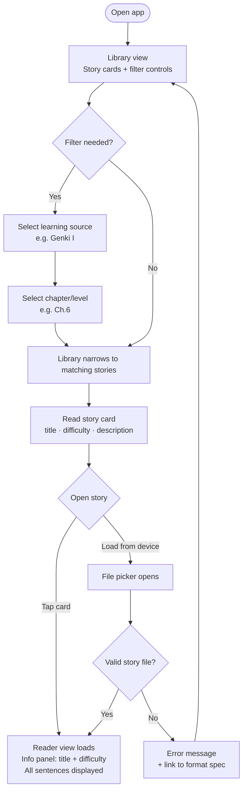
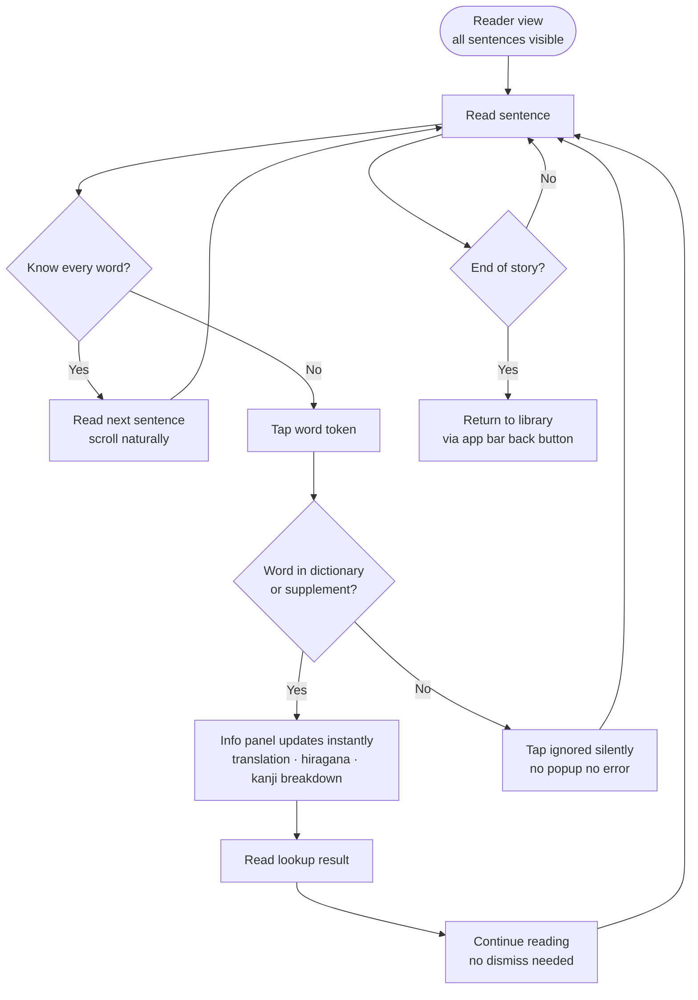
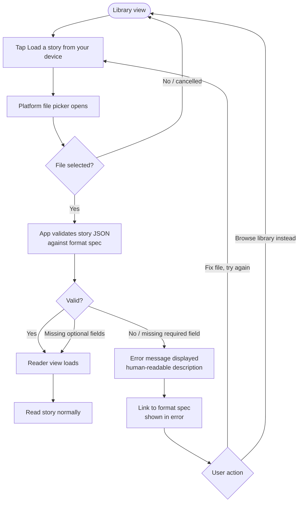
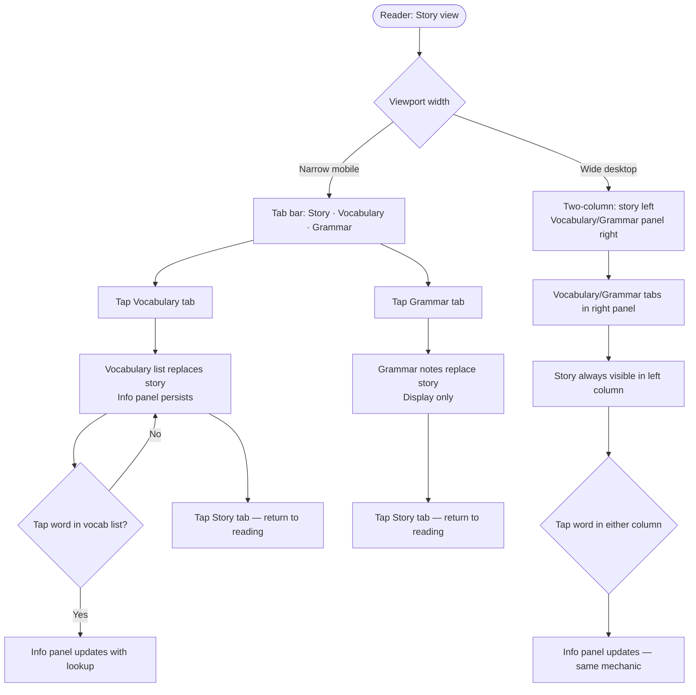

# UX Design Specification nihonnohon

**Author:** RT
**Date:** 2026-05-08

---

<!-- UX design content will be appended sequentially through collaborative workflow steps -->

## Executive Summary

### Project Vision

Nihon no Hon is a focused prose reading experience for Japanese language learners. The UX objective is to make reading feel like reading — not like using a study tool. Word lookup must be available but invisible until needed. The open story format means the app must support both the curated library experience and the local file upload ("I found this story online") experience with equal quality.

The product is intentionally lean: no accounts, no backend, no gamification. The design language should reflect this — quiet, focused, and book-like. The light yellow paper-tone aesthetic is the anchor for a reading-first design philosophy.

### Target Users

**Primary — The Mid-Textbook Learner**
Studying Japanese with Genki I/II or targeting JLPT N5–N3. Has vocabulary and grammar knowledge but finds native material overwhelming. Studies consistently in evening sessions and on commute. High comfort with open-source tooling (Anki, Yomitan). Wants reading practice calibrated to exactly what they have studied. Values immersion over hand-holding.

**Secondary — The Story Author**
Advanced learner or teacher creating story JSON files to share with their study group or the community. Tests stories via the local upload flow. Uses the app infrequently but needs confidence the format is well-documented and the test-and-iterate path is frictionless.

### Key Design Challenges

**1. Japanese text as interactive surface**
Japanese has no spaces between words. The UI must render author-segmented words as individually tappable elements, with optional ruby character annotations above them, and optional inter-word spaces. Achieving reliable tap targets on small kanji glyphs on mobile (iOS Safari primary) and clean hover/click behaviour on desktop is the central technical UX challenge.

**2. Word popup: information density vs. reading context**
The popup must surface three data points (English translation, hiragana reading, kanji breakdown) without obscuring the sentence the reader just tapped. On mobile, it competes for screen space. The popup must feel instant and lightweight — a reference card, not a modal — and must be dismissible without disrupting reading position.

**3. Two-mode navigation: library and reader**
Library browsing (discovery, filtering, choosing) and reading (immersive, linear, focused) are fundamentally different experiences. The reader view should feel like the app disappears into the content. Transitioning cleanly between modes without jarring context switches is a key flow design challenge.

### Design Opportunities

**1. The paper aesthetic as a full design language**
The light yellow background is an invitation to build a quiet, warm, book-like experience. Typography, whitespace, and layout can reinforce "this is a reading space" rather than "this is an app." A restrained design language — few colours, generous spacing, good type — is both aesthetically right and appropriate for the learner's focus state.

**2. The difficulty filter as a moment of belonging**
When a learner who has just finished Genki I Ch.6 sees a list of stories tagged to exactly that chapter, there is a small emotional moment: *this was made for me, right now.* The filter UI can be designed to surface that moment of recognition clearly — reinforcing that the app understands where the user is in their learning.

**3. Toggle micro-interactions as self-assessment gestures**
Ruby character on/off and word spacing on/off are deliberate acts of self-assessment — the learner is either revealing support or hiding it to test themselves. Small, satisfying feedback on these toggles can reinforce the intentionality of the gesture without adding noise to the reading experience.

## Core User Experience

### Defining Experience

The core loop: read a sentence → encounter an unknown word → tap it → see its meaning → continue reading. The tap-to-lookup interaction is the product's entire value proposition in a single gesture. If that moment is instant and non-disruptive, the app works. If it's slow, clunky, or obscures the text, the app fails.

Everything else — library filter, ruby toggle, file upload, word spacing — serves or surrounds this core loop.

### Platform Strategy

- **Platform:** Static SPA deployed as a hosted website; no backend
- **Primary input:** Touch on mobile (iOS Safari is the primary mobile constraint); mouse on desktop
- **Offline behaviour:** Fully functional once loaded — dictionary data bundled client-side; no network dependency during a reading session
- **Native mobile:** Out of scope for v1; web-first with responsive layout covering both form factors

### Effortless Interactions

- **Word tap → popup:** Zero friction, sub-100ms, no loading state, no spinner
- **Sentence navigation:** Single gesture forward/back — no disorientation, no scroll position loss
- **Ruby toggle:** One tap, immediate visual effect, clear feedback that state changed
- **Word spacing toggle:** Same — instant, obvious, no re-render delay
- **Local file load:** Behaves like any standard file-open on the platform — no special knowledge required
- **Difficulty filter:** Two taps to narrow to the learner's exact level — no scrolling through irrelevant content

### Critical Success Moments

1. **First successful word lookup** — the reader taps a kanji compound and the popup appears instantly with translation, hiragana reading, and kanji breakdown. This is the product's "aha" moment and must land on first use.
2. **Finding a story at exactly the right level** — after selecting Genki I → Ch.6, the list narrows to stories calibrated to this exact point in the learner's study. The moment of recognition that the app understands their level is what converts a visitor into a regular user.
3. **Reading a complete story** — finishing a story, having understood most of it, with a handful of lookups along the way. The absence of friction is the accomplishment.

### Experience Principles

1. **Reading-first.** The text is the hero. Navigation, toggles, and controls are present but recede. No persistent toolbar crowding the reading surface.
2. **Instant.** Lookup, toggle, and sentence navigation must feel instantaneous. Any perceptible delay breaks immersion and reminds the reader they are using software.
3. **Scaffolding on demand.** Ruby characters, word spacing, and word lookup are available but unobtrusive. The reader decides how much support they need and when.
4. **Calm.** No notifications, streaks, progress bars, or gamification. The app respects the learner's focus state and stays out of the way.

## Desired Emotional Response

### Primary Emotional Goals

The primary emotional goal is **quiet competence** — after finishing a story, the user should feel: *I actually read that in Japanese.* This is not gamified achievement or streak-based motivation; it is genuine, real-world capability. Every design decision should serve this feeling.

Supporting feelings: focus and absorption during reading, orientation and belonging in the library, calm confidence throughout.

### Emotional Journey Mapping

| Stage | Desired feeling | Emotion to avoid |
|---|---|---|
| Landing / library | Oriented — "this is for my level" | Overwhelmed, lost |
| Selecting a story | Anticipation, appropriate challenge | Anxiety about difficulty |
| Reading | Absorbed, in flow | Distracted, self-conscious |
| Looking up a word | Natural, frictionless | Interrupted, frustrated |
| Finishing a story | Capable, quietly proud | Deflated from too-easy or too-hard |
| Returning to the app | Familiar, habitual | Obligated, reluctant |

### Micro-Emotions

**Lookup normalisation** — looking up a word must never feel like admitting defeat. The popup is a dictionary, not a fail state. No lookup counts, no visual emphasis on how many words were checked.

**Level calibration confidence** — when the difficulty filter surfaces stories tagged to the learner's exact chapter, there should be a small moment of recognition: *this exists for me.* The filter UI can be designed to make that moment land clearly.

**Toggle self-testing** — turning ruby characters off is a deliberate act of self-challenge. The toggle should feel intentional and satisfying, not like a settings control.

### Design Implications

| Emotional goal | UX design approach |
|---|---|
| Quiet competence | Clean completion state; no scoring, no badges |
| Absorption during reading | Minimal chrome; text fills the reading surface; controls recede |
| Lookup as natural reference | Popup is lightweight and fast; no modal overlay; easy dismiss |
| Orientation in library | Clear two-level filter; difficulty labels prominent on story cards |
| Calm | No notifications, no streaks, no progress nudges |
| Toggle intentionality | Visible toggle state; satisfying micro-transition; immediate effect |

### Emotional Design Principles

1. **Competence over reward.** The product does not congratulate or score the user. It simply makes reading possible. Capability is the reward.
2. **Lookup is learning, not failure.** The word popup is a neutral reference tool. Design it to feel like reaching for a dictionary, not triggering an error state.
3. **Calibration creates belonging.** The difficulty filter is an emotional touchpoint, not just a utility. The moment a learner finds stories matched to their exact chapter should feel personalised.
4. **Calm is a feature.** The absence of gamification mechanics is intentional and visible in the design. The quiet aesthetic reinforces that this is a reading space, not a study app.

## UX Pattern Analysis & Inspiration

### Inspiring Products Analysis

**Kindle**
The benchmark for distraction-free reading. Key patterns: generous margins and whitespace let text breathe; paper-white background (analogous to nihonnohon's light yellow) reduces eye strain; minimal chrome recedes while reading with controls surfaced only on deliberate interaction; font size adjustment is a first-class feature. The overall effect is that the reader forgets they are using software. This is the aesthetic and focus model nihonnohon aspires to.

**Readle** (direct inspiration and reference)
A Japanese language reading app with tap-to-translate. Its most important UX insight: translation information is displayed in a **persistent top panel with fixed height** rather than a floating popup. The panel is always present and simply updates its content when a word is tapped — no appearance animation, no overlay, no layout shift. The reading surface stays completely stable.

Shortcomings identified during review, incorporated as improvements in nihonnohon:
- *Empty panel state:* When no word is selected, the panel is blank. Nihonnohon uses this space for story context (title, difficulty, sentence position), transitioning to lookup content on word tap.
- *No kanji breakdown:* Readle shows translation but treats compound words as opaque. Nihonnohon exposes individual kanji components — how learners actually build character recognition.
- *No vocabulary or grammar reference:* Nihonnohon adds author-defined vocabulary and grammar views, accessible alongside the story.

**Anki** (community model)
Foundational for the story format strategy rather than reader UI. The deck format — open, portable, community-shareable — is the direct model for the nihonnohon story JSON. Minimal, functional, zero-friction to the core action.

### New Features Surfaced from Readle Review

**Story vocabulary panel**
Story authors define a keyword vocabulary list in the story JSON — the words this story is designed to teach (e.g. Genki I Ch.6 vocabulary). Schema: `{word, hiragana, translation}`. The vocabulary supplement adopts the same schema. Both sources are merged in the reader's vocabulary view — a unified, browsable list. Tapping any entry opens the full word lookup in the info panel.

**Grammar learning points panel**
Story authors define grammar notes as an array of strings in the story JSON — one element per grammar pattern used in the story. Display-only reading reference.

**Responsive layout for vocabulary and grammar panels:**
- **Wide viewports (desktop):** Two-column layout — story text on the left, vocabulary or grammar panel on the right (tabbed: Vocabulary | Grammar).
- **Narrow viewports (mobile):** Tabbed layout — Story | Vocabulary | Grammar tabs switch the main content area. The persistent top info panel stays in place across all tabs.

### Transferable UX Patterns

| Pattern | Source | Application |
|---|---|---|
| Persistent info panel | Readle | Always-visible top panel; updates on word tap; never modal |
| Panel resting state | Readle (improved) | Shows story context when no word selected |
| Progressive reveal of controls | Kindle | Navigation and toggles recede during reading; surfaced on demand |
| Paper-tone reading surface | Kindle | Light yellow background; generous type; minimal chrome |
| Two-column reference layout | Standard reading apps | Wide: story + vocabulary/grammar side by side |
| Tabbed mode switching | Mobile conventions | Narrow: Story / Vocabulary / Grammar tabs |
| Community format portability | Anki | Story JSON as open, shareable spec |

### Anti-Patterns to Avoid

- **Floating popups** (Yomitan model) — cause layout shifts and require dismissal. Persistent panel is strictly better.
- **Wasted panel real estate** (Readle empty state) — always show useful context in the info panel.
- **Opaque word lookup** (Readle shortcoming) — expose kanji components, not just translation.
- **Gamification chrome** — no streaks, scores, progress bars, or notifications.

### Design Inspiration Strategy

**Adopt:** Persistent top info panel; paper-tone aesthetic; progressive control reveal; open community format model.

**Adopt and improve:** Panel resting state shows story context (not blank); kanji breakdown in lookup; vocabulary and grammar panels as first-class reading companions.

**Design forward (v2):** When study list arrives, kanji from vocabulary list entries should be simultaneously queued for kanji learning — the kanji breakdown in the lookup panel is the visual foundation for this.

## Design System Foundation

### Design System Choice

**Tailwind CSS + Radix UI / shadcn/ui** (headless component library)

### Rationale for Selection

- **Visual freedom:** Tailwind provides utility-first styling with no framework defaults to fight. The paper-tone aesthetic, Japanese text layout, and custom reading UI require complete visual control — not a pre-styled component library.
- **Accessible primitives:** Radix UI / shadcn/ui provides unstyled, accessible components (tabs, popups, toggles, focus management) that handle the hard browser-compatibility and keyboard-navigation work, styled entirely to spec.
- **Solo developer fit:** The Tailwind + shadcn/ui stack is fast to set up, extensively documented, and has a large community. For a solo developer building a portfolio piece, these are forcing multipliers.
- **Modern learning vehicle:** RT's stated goal of learning new web technologies is well-served by this stack — it is the dominant modern SPA approach in 2025/2026 and directly portfolio-relevant.
- **No lock-in:** Tailwind is purely CSS utility classes; Radix primitives are headless. Neither imposes visual opinions on the product.

### Implementation Approach

- Tailwind CSS for all styling — including colour tokens (paper tone, text, accent), typography scale, spacing, and responsive breakpoints
- Radix UI primitives (or shadcn/ui wrappers) for: tabs (Story/Vocabulary/Grammar), toggles (ruby, spacing), focus trap and keyboard handling for the info panel
- Custom components for the Japanese-specific elements: word token rendering, ruby annotation display, info panel layout — these have no standard library equivalent
- Design tokens defined as Tailwind CSS custom properties: background colours, typography, spacing units

### Customization Strategy

- **Colour palette:** `paper-bg` (light yellow), `paper-text` (near-black), `accent` (for active toggle state) — defined as Tailwind theme extensions
- **Typography:** A clean, legible serif or sans-serif for English UI text; system CJK fonts (or a web font with good kanji coverage) for Japanese story text

## Defining Experience

### 2.1 Defining Experience

> *Read a Japanese story. Tap any word you don't know.*

That single interaction — tap an unknown word, instantly see its meaning — is what the product delivers. If this is executed perfectly, everything else follows.

### 2.2 User Mental Model

Learners familiar with Yomitan or Jisho already understand "look up a word while reading." The mental model is established. The key differences in nihonnohon:
- The reading surface is purpose-built — author-segmented word tokens, not arbitrary web content
- Lookup result appears in a persistent top panel, not a floating popup — no dismissal needed, reading position never lost
- The eye develops a habit: tap word, glance up to panel, back to reading

The shift from Yomitan's floating popup to nihonnohon's persistent panel is subtle but important: instead of a popup appearing near the cursor (causing layout shift and requiring dismissal), the panel is a fixed, known location that simply updates its content. The reading surface stays completely stable.

### 2.3 Success Criteria

- Lookup appears in under 100ms — no waiting, no perceived delay
- Story sentence stays fully visible after tapping — panel updates above, reading position unchanged
- No explicit dismissal needed — panel updates to next lookup when next word is tapped
- On mobile, tap targets are generous enough that the intended word is hit reliably on first tap
- Panel content hierarchy is immediately scannable: translation first, hiragana second, kanji breakdown below

### 2.4 Novel UX Patterns

The tap-to-lookup pattern is established (Yomitan, Readle, LingQ all use variants). Nihonnohon uses a **persistent panel variant** rather than a floating popup — less common but immediately intuitive and strictly better for reading immersion. No novel interaction design requires user education; the innovation is in the layout decision and data quality.

The vocabulary and grammar tab/panel mechanic (wide: two-column; narrow: tabs) uses familiar document-viewer patterns. Consistent mechanic: tapping a word anywhere — story text or vocabulary list — updates the same info panel.

### 2.5 Experience Mechanics

| Stage | What happens |
|---|---|
| **Initiation** | Reader encounters an unknown word in the story sentence |
| **Trigger** | Single tap (mobile) or click (desktop) on the word token |
| **Response** | Info panel updates instantly — translation, hiragana reading, kanji breakdown |
| **Reading** | User reads the panel, absorbs the meaning |
| **Continuation** | User continues reading — no dismissal, no gesture, no lost position |
| **Next lookup** | Tap another word — panel updates; previous lookup replaced |
| **Panel at rest** | No word selected — panel shows story title, difficulty, sentence position |

## Visual Design Foundation

### Colour System

Minimal palette — warm reading surface, near-black text, restrained accent. Defined as Tailwind CSS theme extensions.

| Token | Value | Usage |
|---|---|---|
| `paper-bg` | `#FDF6E3` | Reading view background — aged paper tone |
| `paper-text` | `#1C1C1C` | Story text, primary UI text |
| `surface` | `#FFFFFF` | Info panel, library cards, UI chrome |
| `surface-subtle` | `#F5F5F0` | Secondary panels, hover states |
| `accent` | `#C8A85A` | Active toggle state, selected difficulty filter |
| `accent-subtle` | `#F5EDD6` | Hover state on word tokens |
| `muted` | `#6B6B6B` | Secondary text — difficulty labels, sentence position |
| `border` | `#E0D8C8` | Dividers, card borders — warm-toned, not stark grey |
| `error` | `#C0392B` | Validation errors (invalid story file upload) |

`paper-text` on `paper-bg` and `paper-text` on `surface` both exceed WCAG 2.1 AA contrast at all planned text sizes.

### Typography System

Two distinct roles — UI/English text and Japanese story text.

| Role | Font | Rationale |
|---|---|---|
| UI text | `Inter` (system-ui fallback) | Clean, legible, zero personality — lets Japanese content be the focus |
| Japanese story text | `Noto Sans JP` + system CJK fallback | Excellent kanji coverage, free, consistent cross-platform rendering |
| Info panel lookup | `Inter` for English labels; `Noto Sans JP` for hiragana and kanji content | |

**Type scale:**

| Level | Size | Usage |
|---|---|---|
| Story text (base) | `1.25rem` / 20px — user-adjustable | Primary reading content |
| Ruby annotations | `0.6em` relative to word token | Sits above the word; scales with story text size |
| Info panel primary | `1.125rem` / 18px | Translation — first thing the eye lands on |
| Info panel secondary | `0.875rem` / 14px | Hiragana reading, kanji component labels |
| Library UI | `1rem` / 16px | Story cards, filter controls |
| Captions / labels | `0.75rem` / 12px | Difficulty labels, sentence position counter |

Story text size is user-adjustable (FR26 / NFR8) — the type scale above represents the medium/default setting.

### Spacing & Layout Foundation

- **Base unit:** 8px (Tailwind default spacing scale)
- **Reading view max-width:** ~65ch — calibrated for comfortable Japanese text line length; narrower than typical Latin content widths
- **Reading view padding:** Generous horizontal margins; content never touches viewport edges
- **Info panel height:** Fixed ~120–140px on mobile; sufficient for 2–3 lines of lookup content without scrolling
- **Library cards:** Compact — 3–4 cards visible above the fold on mobile without scrolling
- **Column breakpoint:** `lg` (1024px) — below this, tabbed layout (Story | Vocabulary | Grammar); above, two-column (story left, panel right)

**Layout principles:**
1. Reading surface dominates — the story text occupies the majority of viewport height at all times
2. Info panel is fixed, not scrollable in itself — lookup content is short by design
3. Library is scannable — cards show enough metadata (title, difficulty label, description excerpt) to decide without opening

### Accessibility Considerations

- All text/background combinations meet WCAG 2.1 AA contrast
- User-adjustable text size supports at least three settings (small / medium / large), implemented via a Tailwind CSS custom property on the story text container
- Active toggle states use both colour (`accent`) and a visible indicator (not colour alone) — satisfies NFR11
- Word token hover/focus states use `accent-subtle` background, not colour alone
- Escape key dismisses the info panel focus; keyboard scrolling supported in panel when content overflows (NFR9, NFR10)

## Design Direction Decision

### Design Directions Explored

Six directions explored via interactive HTML mockup (`ux-design-directions.html`):

1. Reader — resting state, continuous scroll
2. Reader — active word lookup in info panel
3. Reader — sentence translations visible (Trans toggle on)
4. Vocabulary tab active
5. Library view
6. Desktop two-column layout

### Chosen Direction

The single direction confirmed through review — all six mockups represent one coherent design, not competing alternatives. Direction is confirmed as-is with the following refinements applied during review:

**Reading model:** Continuous scrollable document (all sentences visible), replacing sentence-by-sentence navigation. No advance/back buttons. No sentence counter.

**Language-specific ruby label:** The ルビ toggle button label is derived from the story's language field. Japanese stories display ルビ; other languages use an appropriate equivalent.

**Logo placement:** 日本の本 in small Japanese text, top-right of the app bar in reader views. Prominent in the library header.

**Sentence translation toggle:** A `Trans` button in the toolbar shows/hides English translations beneath each Japanese sentence. Translations are displayed in a distinct muted blue-grey (`#4A7B9D`) to differentiate from Japanese reading content.

### Design Rationale

- Continuous scroll removes artificial pacing — learners read at their own speed and re-read freely
- Persistent info panel (top) + stable story area below = zero layout shift on word tap
- Language-specific ruby label reinforces the language-aware architecture without UI noise
- Translation toggle gives beginners a comprehension check; advanced learners keep it off
- Logo placement is present but understated in the reading view — the text is always the focus

### Implementation Notes

- App bar: `surface` background, `border-bottom: 1px solid border`; logo uses `var(--font-ja)`, `muted` colour
- Story area: `paper-bg` background; `overflow-y: auto`; `max-height` constrained to viewport on mobile
- Translation text: `font-style: italic`, colour `#4A7B9D`, `font-size: 0.8em` relative to story text size
- Trans toggle: same pattern as ルビ and Spaces — `on` state uses `accent-subtle` background + `accent` border
- Toolbar button order (left to right): ルビ · Spaces · Trans · A− · A · A+

## User Journey Flows

### Flow 1: Library → Start Reading

No onboarding screen — land directly in the library. Filter state is the primary interaction on first visit. File upload is a secondary CTA at the bottom of the library list.

### Flow 2: Reading + Word Lookup

Silent failure on unknown words preserves reading flow. No explicit dismissal — reader just continues. Story completion returns to library via the app bar back button.

### Flow 3: Local Story File Upload

Optional missing fields never block loading — only required fields trigger an error. Error message is human-readable with spec link for self-service fix.

### Flow 4: Vocabulary, Grammar, and Mode Switching

Info panel behaviour is identical in all tabs/columns. On wide viewports the story stays visible alongside vocabulary, eliminating mode-switching friction.

### Journey Patterns

**Navigation:** App bar back button (← Library) exits the reader universally. Tab switching is immediate with no loading state.

**Lookup:** One mechanic everywhere — tap word → info panel updates. Applies in Story tab, Vocabulary tab, and desktop vocabulary panel. Silent failure on missing dictionary entries; no error state.

**Error handling:** File validation errors are human-readable and action-oriented. Optional field absence is never an error — graceful degradation.

**Feedback:** Word tap = active token highlight + immediate panel update. Toggle state change = visual button state (accent background/border). File load success = reader view appears; no intermediate success screen.

## Component Strategy

### Design System Components (Radix UI / shadcn/ui)

| Component | Usage |
|---|---|
| `Tabs` | Story / Vocabulary / Grammar tab navigation (mobile); Vocabulary / Grammar panel tabs (desktop) |
| `Select` | Learning source and chapter/level difficulty filter dropdowns |
| `ScrollArea` | Constrained scrollable story area, vocabulary list, grammar list |
| `Toggle` / styled button | ルビ, Spaces, Trans toggles — styled to match design tokens |

### Custom Components

#### WordToken

**Purpose:** The atomic interactive unit of the reading experience. Renders a single author-segmented word with an optional ruby annotation above it.

**Anatomy:** Ruby annotation (optional, positioned above) + word text

**States:**
- Default: plain text on `paper-bg`
- Hover: `accent-subtle` background
- Active (tapped): `accent-subtle` background + 2px `accent` bottom border
- No ruby: text only, no space reserved above

**Variants:** With ruby / without ruby (controlled by parent's ruby toggle state)

**Interaction:** Tap/click triggers word lookup; parent InfoPanel updates. If word has no dictionary or supplement entry, tap is silently ignored.

**Accessibility:** `role="button"`, `tabindex="0"`, `aria-label` containing the word text. Keyboard: Enter/Space triggers lookup.

**Content guidelines:** Word text is author-provided Japanese text. Ruby text is the hiragana reading. Neither should be truncated.

---

#### InfoPanel

**Purpose:** Persistent top panel that displays word lookup data or story context. Never hidden or removed — only its content changes.

**Anatomy:** Fixed-height container with two content states.

**States:**
- *Resting* (no word selected): story title + difficulty label + language metadata
- *Lookup* (word tapped): selected word in Japanese → English translation (large) → hiragana reading → KanjiBreakdown row

**Height:** Fixed — approx 110–140px on mobile; same height maintained in both states to prevent layout shift.

**Transitions:** Content swap is immediate — no animation. Speed is the experience.

**Desktop variant:** Splits into two columns — lookup data left, story context right — at `lg` breakpoint.

**Accessibility:** `aria-live="polite"` so screen readers announce lookup result changes. `aria-label="Word lookup panel"`.

---

#### KanjiBreakdown

**Purpose:** Displays individual kanji characters from a looked-up word alongside their meanings.

**Anatomy:** Horizontal row of kanji items. Each item: large kanji character above, small meaning label below.

**States:** Hidden when the looked-up word contains no kanji (hiragana-only words).

**Content guidelines:** Kanji character from KANJIDIC2; meaning is the primary English gloss. Maximum 4–5 kanji visible before scrolling within the row.

---

#### SentenceBlock

**Purpose:** Container for one sentence — a row of WordTokens plus an optional translation line below.

**Anatomy:** WordToken row (flex-wrap, `paper-bg`) + optional translation text beneath.

**States:**
- Translation hidden (Trans toggle off): word row only
- Translation visible (Trans toggle on): word row + translation text in italic `#4A7B9D`

**Content guidelines:** Translation text is author-provided; optional per sentence. If absent and Trans is on, nothing is shown below that sentence.

---

#### AppBar

**Purpose:** Thin navigation bar at the top of the reader and library views.

**Anatomy (reader):** Back link (← Library) left · 日本の本 logo right

**Anatomy (library):** Logo centred or right; no back link

**Logo:** 日本の本 in `var(--font-ja)`, `muted` colour, small (15px). Functionally decorative — not a home button.

**Accessibility:** Back link is a proper anchor/button with `aria-label="Back to library"`.

---

#### ToolBar

**Purpose:** Strip of reading-aid toggles between the InfoPanel and the story area.

**Anatomy:** Left group: ルビ · Spaces · Trans toggles. Right group: A− · A · A+ size buttons.

**Toggle button states:** Off = `surface` background, `border` border, `muted` text. On = `accent-subtle` background, `accent` border, `paper-text` text.

**Size buttons:** Tapping A− / A+ adjusts a CSS custom property on the story container. The A button resets to default size. No active state needed on size buttons.

**Language-specific labels:** ルビ label is derived from the story's `language` field. Japanese → ルビ. Other languages → appropriate equivalent or "Ruby" as fallback.

---

#### StoryCard

**Purpose:** Library list item representing a single story.

**Anatomy:** English title (bold) · Japanese title (muted, smaller) · DifficultyBadge · Description excerpt

**States:** Default · Hover (accent border)

**Interaction:** Tap opens the reader view for that story.

**Content guidelines:** Description should be 1–2 lines maximum. Japanese title uses `var(--font-ja)`.

---

#### DifficultyBadge

**Purpose:** Pill label showing story difficulty.

**Anatomy:** Rounded pill, `accent-subtle` background, `accent` border, small text.

**Content:** "Genki I · Ch.6" or "JLPT N4". Blank/absent when difficulty is unspecified (not shown at all rather than showing an empty badge).

---

#### VocabItem

**Purpose:** Row in the vocabulary panel showing a word, its reading, and translation.

**Anatomy:** Word (large, `font-ja`) · Reading (smaller, muted, `font-ja`) · Translation (regular)

**States:** Default · Hover (`accent-subtle` background) · Active (same as hover, persists while info panel shows this word's lookup)

**Interaction:** Tap triggers same word lookup as WordToken — InfoPanel updates with the word's data.

---

### Component Implementation Strategy

- All custom components are built with Tailwind utility classes and the defined design tokens
- Radix UI provides the accessibility primitives (focus management, ARIA, keyboard) for Tabs and Select; custom components handle their own accessibility as specified above
- Custom components are scoped — built only for the interactions this product requires; no generalisation beyond what is used
- Design tokens (`paper-bg`, `accent`, `border`, etc.) are defined as Tailwind theme extensions in `tailwind.config.js`

### Implementation Roadmap

**Phase 1 — Core reading experience (required for first usable build):**
- WordToken, InfoPanel, KanjiBreakdown, SentenceBlock, AppBar, ToolBar

**Phase 2 — Library and navigation:**
- StoryCard, DifficultyBadge, library filter UI (Radix Select), file upload trigger

**Phase 3 — Vocabulary and grammar panels:**
- VocabItem, vocabulary list layout, grammar list layout, Radix Tabs integration
- **Spacing scale:** Generous — reading content needs room to breathe
- **Component scope:** Only build what the product needs. No component library sprawl. The reading UI, info panel, library card, difficulty filter, and tab navigation are the core components.

### PRD Amendments Required

The following updates to the PRD are needed before architecture begins:

**Story format (new/updated fields):**
- Keyword vocabulary list: `{word, hiragana, translation}[]` — author-defined study vocabulary
- Grammar learning points: `string[]` — author-defined grammar notes
- Vocabulary supplement schema updated to `{word, hiragana, translation}` (harmonised with keyword list)

**Reader (new FRs):**
- Reader can view a unified vocabulary panel combining keyword vocabulary and vocabulary supplement entries
- Reader can tap a word in the vocabulary panel to open word lookup in the info panel
- Reader can view grammar learning points for the current story
- Wide viewports: vocabulary and grammar panels display in two-column layout alongside story
- Narrow viewports: Story, Vocabulary, and Grammar accessible via tabs

## UX Consistency Patterns

### Interaction Feedback

**Word tap feedback:** Active state applied to WordToken immediately on tap — `accent-subtle` background + 2px `accent` bottom border. InfoPanel updates in the same frame. No animation or delay. Active state clears when another word is tapped; does not persist after lookup.

**Toggle feedback:** Toggle buttons change state immediately on tap. On state: `accent-subtle` background + `accent` border. Off state: `surface` background + `border` border. The visual state change is the feedback — no toast, no animation.

**File upload feedback:** Platform native file picker — no custom UI. On valid file: reader view replaces library immediately. On invalid file: error message appears inline in library view. No loading spinner needed for typical file sizes.

### Navigation Patterns

**Library ↔ Reader:** Reader entered by tapping a story card or completing file upload. Exit via app bar back link (← Library). No swipe-to-dismiss or gesture navigation.

**Tab navigation (mobile):** Story / Vocabulary / Grammar tabs at bottom of reader. Active tab: `accent` bottom border + `paper-text` label. Inactive: `muted` text. Content switches immediately — no transition animation. Scroll position in story preserved when switching tabs and returning.

**Panel tabs (desktop):** Vocabulary / Grammar tabs in right panel use same visual treatment. Story column unaffected by panel tab switching.

### Empty States

**Library — no stories match filter:** "No stories found for this selection." Two actions: reset filter, or load from device. Text only, `muted` colour. No illustration.

**Vocabulary panel — no vocabulary defined:** "No vocabulary defined for this story." Grammar equivalent: "No grammar notes for this story." Both `muted`, centred.

**InfoPanel resting state:** Always shows story title + difficulty + language. Never blank.

### Error Patterns

**Story file validation failure:**
- Human-readable message: "This doesn't look like a valid Nihon no Hon story."
- Specific hint where possible (e.g. "The 'sentences' field is missing or not an array")
- Link to format spec always shown: "View the story format documentation"
- Appears inline below upload trigger — not a modal
- Dismissible by tapping elsewhere or selecting a library story
- Error text colour: `error` (`#C0392B`)

**Dictionary unavailable:** Word taps silently ignored — same as unknown word. No error disrupts reading.

### Filtering Patterns

**Two-level difficulty filter:**
- Source selector (Genki I / Genki II / JLPT / All) always visible
- Chapter/level selector updates to reflect valid options for selected source
- Selecting "All sources" hides or disables chapter/level selector
- Library updates immediately on each selection — no "Apply" button
- Active filter dropdowns: `accent-subtle` background + `accent` border

### Graceful Degradation Patterns

| Missing field | Behaviour |
|---|---|
| No `ruby` array on sentence | Words render without annotations; ルビ toggle has no visible effect for that sentence |
| No `translation` on sentence | Trans toggle shows nothing below that sentence — no blank line |
| No `keywords` list | Vocabulary panel shows supplement entries only, or empty state if both absent |
| No `grammar` array | Grammar panel shows empty state message |
| No `difficulty` field | DifficultyBadge not rendered on story card — blank, not "Unspecified" |
| No `language` field | ルビ button falls back to label "Ruby" |

### Future Navigation Considerations (v2+)

Not implemented in v1. Current design does not close off these paths:

**User accounts:** A user avatar / account entry point will eventually live in the top-right of the AppBar. In v1 the logo occupies that space in the reader view. In the library view the logo should be left-aligned or centred, leaving top-right available for future account state without a layout change.

**Settings page:** All reading controls are in the reader toolbar in v1. A future settings page will need a navigation entry point — most naturally an icon in the app bar alongside account state. No settings entry point exists in v1.

**Online story catalog:** The current library shows bundled stories plus local file upload. A future community catalog will add a browsing mode — either as a secondary tab (My Stories / Community) or a distinct section in the library. The current filter and card patterns extend naturally to community stories; no structural redesign anticipated.

## Responsive Design & Accessibility

### Responsive Strategy

Mobile-first. The core reading experience is designed for narrow portrait screens first — single column, vertically stacked, touch-optimised. Tablet landscape and desktop are additive enhancements.

| Device | Orientation | Layout |
|---|---|---|
| Smartphone | Portrait (supported) | Single column, tab navigation |
| Smartphone | Landscape | Not supported — portrait only |
| Tablet | Portrait | Single column, tab navigation |
| Tablet | Landscape | Two-column, panel navigation |
| Desktop | Any | Two-column, panel navigation |

**Single-column layout (smartphone portrait, tablet portrait):**
- Info panel fixed at top (full width); toolbar below
- Story area fills remaining height, scrollable
- Story / Vocabulary / Grammar accessed via bottom tab bar
- All interactive elements sized for tap (minimum 44×44px touch targets)

**Two-column layout (tablet landscape ≥ 1024px, desktop):**
- Info panel spans full width above both columns
- Story left, vocabulary/grammar panel right
- Bottom tab bar replaced by Vocabulary/Grammar tabs in the right panel
- Story column max-width ~65ch — calibrated for Japanese text line length

**Smartphone landscape:** Not a supported orientation. Portrait layout displays if the user rotates but is not optimised. A soft orientation nudge via CSS `@media (orientation: landscape) and (max-width: 767px)` may be added during implementation.

### Breakpoint Strategy

Tailwind CSS default breakpoints, mobile-first. One primary structural breakpoint:

| Breakpoint | Width | Layout change |
|---|---|---|
| Default | < 1024px | Single column — smartphone portrait + tablet portrait |
| `lg` | ≥ 1024px | Two-column — tablet landscape + desktop |

The `lg` breakpoint at 1024px naturally captures tablet landscape orientation (typically 1024px+). No intermediate breakpoints needed for the major layout shift.

### Accessibility Strategy

**Target level:** WCAG 2.1 AA — industry standard. Practical floor, not a compliance checkbox.

**Colour contrast:** All text/background combinations meet 4.5:1 AA minimum.
- `paper-text` (#1C1C1C) on `paper-bg` (#FDF6E3) ≈ 14:1 ✓
- `paper-text` on `surface` (#FFFFFF) ≈ 18:1 ✓
- `muted` (#6B6B6B) on `surface` ≈ 5.7:1 — passes AA for large text; used only for secondary labels ✓

**Touch targets:** All interactive elements meet 44×44px minimum. WordTokens for single kanji characters are the tightest case — tap area padded beyond the visible character bounds.

**Keyboard support:**
- Info panel: Escape dismisses focus; keyboard-scrollable when content overflows
- WordTokens: `tabindex="0"`, Enter/Space triggers lookup
- Tab bar: keyboard navigable
- App bar back link: proper `<a>` element with `aria-label`

**Colour-independent states:** Toggle states use both colour (accent background) and border change — not colour alone. Active WordToken uses bottom border in addition to background tint.

**Screen reader:** Not targeted for v1. `aria-live="polite"` on InfoPanel for lookup result announcements. Semantic HTML throughout. Full screen reader support for Japanese text deferred to a future version.

**No motion:** No animations defined in v1 — all state changes are instant. No `prefers-reduced-motion` consideration needed.

### Testing Strategy

**Responsive testing:**
- Primary: iOS Safari on iPhone (portrait) — the most restrictive mobile browser
- Secondary: Chrome on Android (portrait)
- Tablet landscape: test at 1024px breakpoint on a real iPad or browser DevTools
- Desktop: Chrome, Firefox, Safari, Edge — last 2 versions
- Explicitly verify the `lg` breakpoint transition — layout switch at 1024px must be clean
- Verify story area scroll behaviour on iOS (momentum scrolling, overscroll bounce)

**Accessibility testing:**
- Automated: axe or Lighthouse on library, reader, and vocabulary panel views
- Manual: keyboard-only navigation through all primary flows
- Contrast: verify all colour combinations with a contrast checker
- Touch targets: verify tap accuracy on smallest word tokens on a real device

**Performance testing:**
- Verify word lookup latency on a mid-range mobile device (not just desktop)
- Verify initial load time with full dictionary bundle on a realistic mobile connection

### Implementation Guidelines

**Responsive:**
- Use `rem`/`em` for typography, `%`/`ch` for widths — avoid fixed `px` for layout
- Mobile-first Tailwind classes; `lg:` prefix for desktop overrides
- Story area height: `calc(100dvh - [panel] - [toolbar] - [tab bar])` — use dynamic viewport units (`dvh`) for iOS Safari address bar behaviour
- InfoPanel height: fixed with `min-h`; `overflow-y: auto` for content exceeding it

**Accessibility:**
- Semantic HTML: `<main>` for story/library, `<nav>` for tab bar, `<header>` for app bar
- InfoPanel: `aria-live="polite"` + `aria-label="Word lookup"`
- WordToken: `role="button"`, `tabindex="0"`, `aria-label` with word text
- DifficultyBadge: `aria-label` with full difficulty string
- Filter dropdowns: native `<select>` or Radix Select with associated `<label>`
